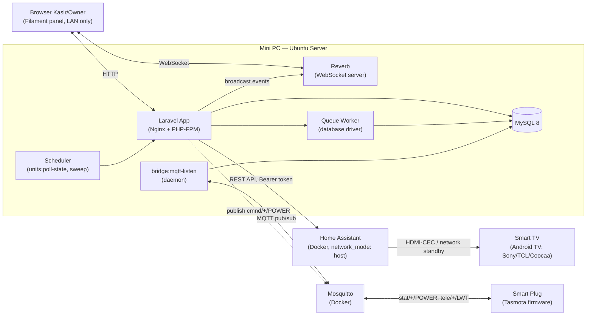
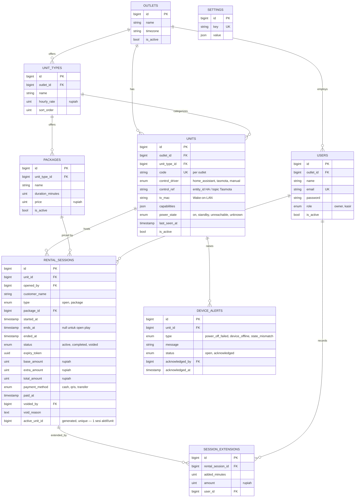
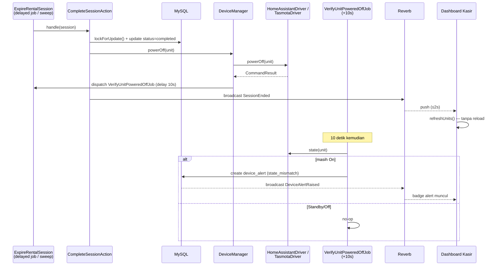

# Creative Trees Billing Game

Sistem billing rental PlayStation — Laravel 13 + Filament v5 + Reverb. Menangani uang sungguhan: satu sumber kebenaran untuk sesi, tarif, dan kontrol TV per unit.

Lihat juga: [`DECISIONS.md`](DECISIONS.md) (keputusan teknis & alasannya per fase) dan [`RUNBOOK.md`](RUNBOOK.md) (operasional harian, insiden, tugas manusia).

## Prinsip arsitektur

1. **Laravel adalah satu-satunya source of truth.** Home Assistant dan Tasmota hanya *tangan* (eksekutor). State billing tidak pernah bergantung pada state device.
2. **Waktu selalu otoritas server.** Durasi dan biaya dihitung dari `started_at`/`ends_at`/`ended_at` di server; timer di browser hanya tampilan.
3. **Uang = integer rupiah.** Tidak ada float di kolom, kalkulasi, maupun response.
4. **Realtime terukur:** perubahan state tampil di dashboard ≤ 2 detik via Reverb, dengan fallback polling 15 detik jika WebSocket putus.
5. **Fail loud, fail secure.** Perintah device yang gagal menghasilkan alert yang terlihat kasir, bukan kegagalan diam-diam.

## Topologi komponen



## ERD



`outlet_id` ada di `users`/`unit_types`/`units` sejak V1 sebagai fondasi siap-scale — V1 sendiri berjalan single-outlet, tanpa UI ganti-outlet (lihat `DECISIONS.md` Fase 0).

## Sequence: sesi berakhir → TV mati



## Menjalankan lokal

```bash
composer install
cp .env.example .env && php artisan key:generate
php artisan migrate --seed
composer run dev   # server + queue:listen + reverb:start + schedule:work, paralel
```

**Tidak ada build step frontend sama sekali** — tanpa Node, tanpa npm, tanpa Vite. Seluruh antarmuka memakai Filament yang aset CSS/JS-nya sudah ter-compile dan ter-publish ke `public/` oleh `php artisan filament:upgrade` (sudah otomatis lewat `post-autoload-dump` di `composer.json`).

Unit dengan `control_driver=manual` tidak butuh Home Assistant/Mosquitto apa pun — cukup untuk development. Untuk mencoba driver HA/Tasmota sungguhan, lihat `docker-compose.devices.yml` (Linux only, lihat komentar di file itu) dan `RUNBOOK.md`.

## Test

```bash
php artisan test              # Feature + Unit
php artisan test --testsuite=Concurrency   # butuh DB nyata, bukan transaksi in-memory
```

## Stack (versi dikunci)

PHP 8.5 · Laravel 13 · Filament v5 (Livewire 4) · MySQL 8 · Reverb · Pest v4 · `php-mqtt/client` · `spatie/laravel-activitylog` · `laravel/boost`.
