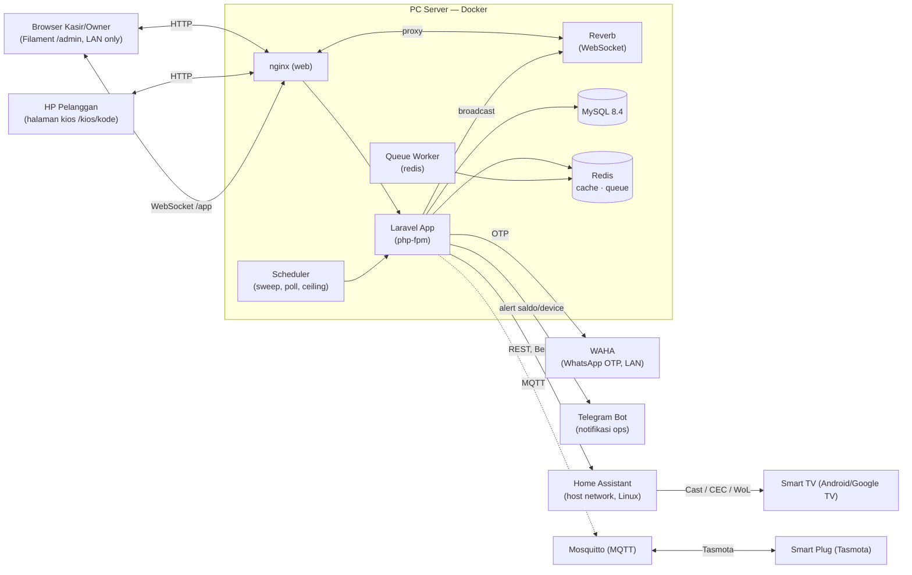
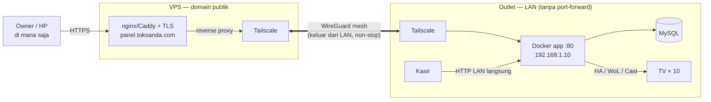
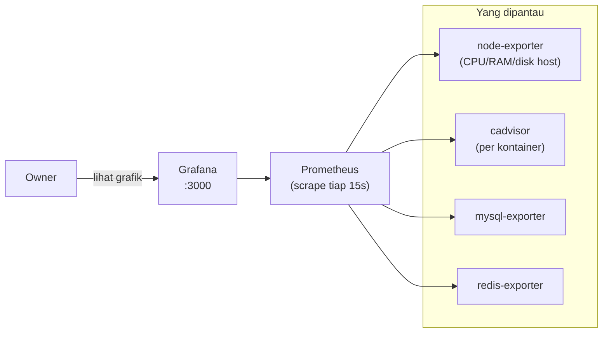
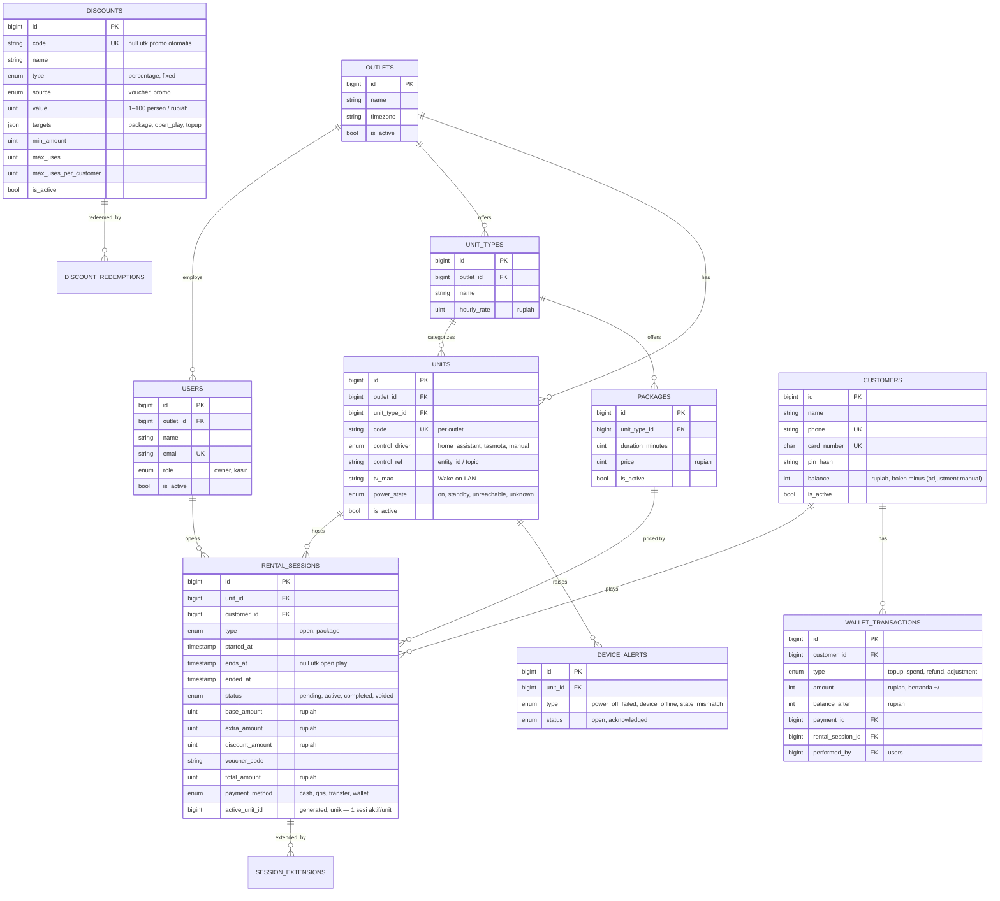
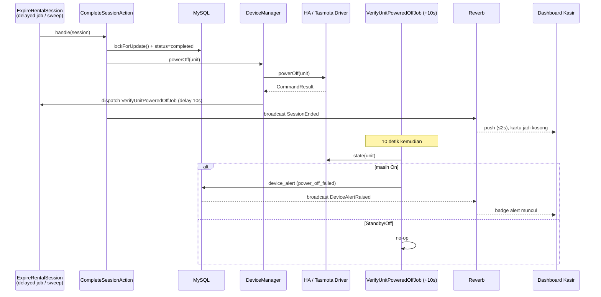

# Creative Trees Billing Game

> Sistem billing rental PlayStation berbasis **Laravel 13 + Filament v5 + Reverb**.
> Menangani **uang sungguhan**: satu sumber kebenaran untuk saldo, sesi, tarif, dan
> kontrol TV per unit. Realtime ≤ 2 detik, kontrol penuh dari **lokal maupun online**.

Dokumen ini adalah **satu-satunya dokumentasi** proyek: arsitektur, spesifikasi,
instalasi (Docker & bare-metal), operasional harian, monitoring Grafana, panduan
pengguna 3 tingkat, dan keputusan teknis — semuanya di sini.

---

## Daftar Isi

1. [Ringkasan & prinsip](#1-ringkasan--prinsip)
2. [Arsitektur & topologi](#2-arsitektur--topologi)
   - [2.1 Jaringan lokal 1 server + 10 TV](#21-jaringan-lokal-1-server--10-tv)
   - [2.2 Topologi komponen](#22-topologi-komponen)
   - [2.3 Kontrol online: Local ↔ Public (VPS + domain)](#23-kontrol-online-local--public-vps--domain)
   - [2.4 Alur satu sesi 10 TV](#24-alur-satu-sesi-10-tv)
3. [Spesifikasi (hardware & software)](#3-spesifikasi-hardware--software)
4. [Instalasi](#4-instalasi)
   - [4.1 Docker di PC lokal (REKOMENDASI)](#41-docker-di-pc-lokal-rekomendasi)
   - [4.2 Docker di VPS dari GitHub](#42-docker-di-vps-dari-github)
   - [4.3 Menyambungkan Local ↔ Public (Tailscale)](#43-menyambungkan-local--public-tailscale)
   - [4.4 Alternatif: bare-metal (nginx + supervisor)](#44-alternatif-bare-metal-nginx--supervisor)
5. [Menyalakan, mematikan, menyalakan ulang](#5-menyalakan-mematikan-menyalakan-ulang)
6. [Monitoring Grafana (offline)](#6-monitoring-grafana-offline)
7. [Panduan pengguna (3 tingkat)](#7-panduan-pengguna-3-tingkat)
8. [Operasional & runbook](#8-operasional--runbook)
9. [Troubleshooting](#9-troubleshooting)
10. [Keputusan teknis penting](#10-keputusan-teknis-penting)
11. [Referensi teknis (ERD, sequence, test, stack)](#11-referensi-teknis)

---

## 1. Ringkasan & prinsip

Pelanggan main PlayStation, dibayar dari **saldo** (top-up QRIS/transfer/tunai).
Kasir & owner memakai **panel Filament** di `/admin`; pelanggan memakai **halaman
kios** per unit (`/kios/{kode}`) — satu-satunya halaman tanpa login. TV dinyalakan
& dimatikan otomatis lewat jaringan (Home Assistant / Wake-on-LAN / Google Cast),
**tanpa hardware HDMI tambahan**.

### Prinsip arsitektur

1. **Laravel satu-satunya source of truth.** Home Assistant & Tasmota hanya *tangan*. State billing tak pernah bergantung pada state device.
2. **Waktu otoritas server.** Durasi & biaya dihitung dari `started_at`/`ends_at`/`ended_at`; timer browser hanya tampilan.
3. **Uang = integer rupiah.** Tidak ada float di kolom, kalkulasi, maupun response. Saldo dipotong di dalam kunci baris (row lock) — tak ada main tanpa bayar.
4. **Realtime terukur.** Perubahan tampil di dashboard ≤ 2 detik via Reverb; fallback polling 15 detik bila WebSocket putus.
5. **Fail loud, fail secure.** Perintah device yang gagal memunculkan alert yang terlihat kasir, bukan kegagalan diam-diam.
6. **LAN-only untuk panel.** Panel & database **tidak pernah** dipapar internet langsung (tanpa port-forward). Akses online hanya lewat VPN mesh / reverse-proxy tertunnel — lihat §2.3.

---

## 2. Arsitektur & topologi

### 2.1 Jaringan lokal 1 server + 10 TV

Semua di **satu jaringan / subnet yang sama**. Router membagi IP (DHCP), switch
menyambungkan semua perangkat dengan **kabel LAN**, PC server menjalankan seluruh
aplikasi (di dalam Docker).

```mermaid
flowchart TD
    Internet((Internet / ISP)) --> Router["Router<br/>192.168.1.1<br/>(DHCP + reservasi IP)"]
    Router --> Switch["Switch Gigabit 16-port"]
    Switch --> Server["PC SERVER<br/>192.168.1.10<br/>Docker: app · db · redis · reverb · worker · scheduler · grafana"]
    Switch --> TV1["TV 1 — 192.168.1.101"]
    Switch --> TV2["TV 2 — 192.168.1.102"]
    Switch --> TVd["… TV 3–9 …"]
    Switch --> TV10["TV 10 — 192.168.1.110"]

    Server -. "kontrol nyala/mati<br/>(Wake-on-LAN + Cast + HA)" .-> TV1
    Server -. .-> TV2
    Server -. .-> TVd
    Server -. .-> TV10

    Kasir["Laptop/HP Kasir<br/>(browser → 192.168.1.10)"] --- Switch
```

**Aturan emas jaringan lokal:**

| Hal | Nilai | Kenapa |
|-----|-------|--------|
| Subnet | satu, mis. `192.168.1.0/24` | TV, server, kasir harus saling terlihat (mDNS/Cast/WoL tak lewat router) |
| IP server | **statis / reservasi DHCP** (`192.168.1.10`) | `VITE_REVERB_HOST` & `APP_URL` menunjuk ke IP ini; kalau berubah, realtime & QR mati |
| IP tiap TV | **reservasi DHCP** | Wake-on-LAN & entity Home Assistant terikat MAC/IP; IP acak = TV salah dinyalakan |
| Kabel TV | **LAN (bukan WiFi)** untuk WoL andal | WoL lewat WiFi sering gagal saat TV standby |
| TV | Android TV / Google TV (mendukung Cast) | QR & layar idle dikirim via `media_player.play_media` |

> **Tugas manusia (bukan bagian kode):** reservasi DHCP di router, aktifkan
> Wake-on-LAN + "Networked Standby" di setiap TV, dan pasangkan TV ke Home
> Assistant. Lihat §8.

### 2.2 Topologi komponen


```mermaid
flowchart LR
    Kasir["Browser Kasir/Owner<br/>(Filament /admin, LAN only)"]
    Pelanggan["HP Pelanggan<br/>(halaman kios /kios/kode)"]

    subgraph Server["PC Server — Docker"]
        Web["nginx (web)"]
        Laravel["Laravel App<br/>(php-fpm)"]
        Reverb["Reverb<br/>(WebSocket)"]
        Worker["Queue Worker<br/>(redis)"]
        Scheduler["Scheduler<br/>(sweep, poll, ceiling)"]
        MySQL[("MySQL 8.4")]
        Redis[("Redis<br/>cache · queue")]
    end

    HA["Home Assistant<br/>(host network, Linux)"]
    Mosquitto["Mosquitto (MQTT)"]
    TV["Smart TV (Android/Google TV)"]
    Plug["Smart Plug (Tasmota)"]
    WAHA["WAHA<br/>(WhatsApp OTP, LAN)"]
    TG["Telegram Bot<br/>(notifikasi ops)"]

    Kasir <-->|HTTP| Web
    Pelanggan <-->|HTTP| Web
    Web --> Laravel
    Kasir <-->|WebSocket /app| Web
    Web <-->|proxy| Reverb
    Laravel --> MySQL
    Laravel --> Redis
    Worker --> Redis
    Scheduler --> Laravel
    Laravel -->|broadcast| Reverb
    Laravel -->|REST, Bearer| HA
    HA -->|Cast / CEC / WoL| TV
    Laravel -.->|MQTT| Mosquitto
    Mosquitto <-->|Tasmota| Plug
    Laravel -->|OTP| WAHA
    Laravel -->|alert saldo/device| TG
```

Satu **image Docker** menjalankan semua peran aplikasi (web, reverb, worker,
scheduler); perannya ditentukan `command` di `docker-compose.yml`, bukan image
berbeda. Home Assistant & Mosquitto berjalan terpisah (`docker-compose.devices.yml`,
`network_mode: host`) karena butuh mDNS/WoL yang tidak melewati jaringan bridge
Docker — aplikasi menghubunginya lewat IP LAN server (`HA_BASE_URL`, `MQTT_HOST`).

### 2.3 Kontrol online: Local ↔ Public (VPS + domain)

Owner ingin memantau & mengontrol dari **mana saja lewat domain**, tapi mesin
outlet **tidak boleh** dipapar ke internet (§14 / prinsip #6). Solusinya: **VPS
memegang domain + TLS**, dan tersambung ke outlet lewat **VPN mesh WireGuard
(Tailscale)** — koneksi keluar dari LAN, **tanpa port-forward**, tersambung
non-stop.


```mermaid
flowchart LR
    Owner["Owner / HP<br/>di mana saja"]

    subgraph VPS["VPS — domain publik"]
        Caddy["nginx/Caddy + TLS<br/>panel.tokoanda.com"]
        TSv["Tailscale"]
    end

    subgraph Outlet["Outlet — LAN (tanpa port-forward)"]
        TSo["Tailscale"]
        AppL["Docker app :80<br/>192.168.1.10"]
        DBL[("MySQL")]
        TVL["TV × 10"]
        KasirL["Kasir"]
    end

    Owner -->|HTTPS| Caddy
    Caddy -->|reverse proxy| TSv
    TSv <==>|"WireGuard mesh<br/>(keluar dari LAN, non-stop)"| TSo
    TSo --> AppL
    AppL --> DBL
    AppL -->|HA / WoL / Cast| TVL
    KasirL -->|HTTP LAN langsung| AppL
```

**Pembagian peran:**

- **Kasir di outlet** → akses langsung `http://192.168.1.10` (cepat, tak lewat internet). Kalau internet mati, kasir tetap jalan penuh.
- **Owner online** → `https://panel.tokoanda.com` → VPS → tunnel Tailscale → app outlet. Yang keluar dari LAN hanya koneksi WireGuard milik Tailscale; tidak ada satu port pun yang dibuka di router outlet.
- **Data tetap di outlet.** VPS hanya reverse-proxy; database tak pernah pindah ke cloud. Kalau VPS mati, operasional lokal tak terganggu.

> Kenapa bukan taruh aplikasi di VPS saja? Karena kontrol TV (mDNS/SSDP,
> Wake-on-LAN, pemindai jaringan) hanya bekerja di **jaringan yang sama dengan
> TV**. VPS di pusat data tak punya jalan ke `192.168.1.x`. Jadi mesin di outlet
> adalah **syarat**, bukan pilihan.

### 2.4 Alur satu sesi 10 TV

Dengan 10 TV, tidak ada yang berubah secara arsitektur — tiap unit berdiri
sendiri, satu sesi aktif per unit (dijamin kolom unik `active_unit_id`). Kasir
melihat 10 kartu unit di dashboard; tiap kartu update realtime sendiri.

```mermaid
sequenceDiagram
    participant P as Pelanggan (HP)
    participant K as Kios /kios/kode
    participant A as Laravel (Action)
    participant DB as MySQL
    participant HA as Home Assistant
    participant TV as TV unit
    participant R as Reverb
    participant D as Dashboard Kasir

    P->>K: buka QR unit, login WA (OTP/PIN)
    P->>K: pilih paket / Open Play (bayar dari saldo)
    K->>A: PlayFromWalletAction / StartKioskOpenPlayAction
    A->>DB: lock baris, potong saldo, buat sesi
    A->>HA: powerOn(unit) — WoL + turn_on
    HA->>TV: nyala
    A->>HA: play_media(QR/idle habis) → layar main
    A->>R: broadcast SessionStarted
    R-->>D: kartu unit jadi "AKTIF" (≤2s)
    Note over A,DB: scheduler tiap menit: sweep sesi habis,<br/>jaga plafon Open Play; tiap 10s poll QRIS
    A->>HA: (saat habis) powerOff(unit)
    HA->>TV: mati / standby
    A->>R: broadcast SessionEnded
    R-->>D: kartu unit jadi "KOSONG"
```

---

## 3. Spesifikasi (hardware & software)

### PC Server lokal (untuk ±10 TV)

| Komponen | Minimum | Rekomendasi |
|----------|---------|-------------|
| CPU | 4 core (Intel i3 gen-8 / Ryzen 3) | 6+ core (i5/Ryzen 5) |
| RAM | 8 GB | 16 GB |
| Disk | 128 GB SSD | 256 GB SSD (NVMe) |
| Jaringan | 1× Gigabit Ethernet (kabel ke switch) | idem + WiFi cadangan |
| OS | **Ubuntu Server 24.04 LTS** (Linux wajib untuk kontrol device) | idem |
| Daya | UPS kecil sangat dianjurkan (jaga DB saat listrik kedip) | UPS + auto-shutdown |

> Mini PC (Intel NUC / sejenis) sangat cocok: hemat daya, senyap, cukup kuat
> untuk 10 TV. Windows/macOS bisa untuk **mencoba** (pakai `control_driver=manual`),
> tapi kontrol TV nyata (mDNS/WoL) butuh Docker Engine di **Linux**.

### Jaringan

- 1 Router (DHCP), 1 Switch Gigabit (port ≥ jumlah TV + server + 2 cadangan).
- Kabel LAN Cat5e/Cat6 ke tiap TV & ke server.
- Semua di **satu subnet**.

### VPS (untuk kontrol online — opsional tapi dianjurkan)

| Komponen | Nilai |
|----------|-------|
| Spek | 1 vCPU / 1 GB RAM cukup (hanya reverse-proxy) |
| OS | Ubuntu 24.04 LTS |
| Perangkat lunak | nginx atau Caddy (TLS otomatis) + Tailscale |
| Domain | 1 subdomain, mis. `panel.tokoanda.com` → IP VPS |

### Software (semua sudah disiapkan di image Docker)

PHP 8.5 · Laravel 13 · Filament v5 (Livewire 4) · MySQL 8.4 · Redis 7 (predis) ·
Reverb · **tanpa Node/npm/Vite** (aset Filament sudah ter-compile di `public/`).
Untuk device: Home Assistant + Mosquitto. Untuk monitoring: Prometheus + Grafana +
node/cadvisor/mysql/redis exporter.

---

## 4. Instalasi

Ada **dua jalur deploy — pilih SATU per mesin**, jangan campur:

- **Docker (§4.1–4.2, REKOMENDASI):** satu perintah, semua service terisolasi, monitoring ikut. Cocok untuk PC lokal maupun VPS.
- **Bare-metal (§4.4):** nginx + PHP-FPM + supervisor langsung di OS. Sudah tersedia di `deploy/` untuk yang tak mau Docker.

Prasyarat Docker (sekali saja):

```bash
# Ubuntu 24.04
curl -fsSL https://get.docker.com | sh
sudo usermod -aG docker $USER && newgrp docker   # agar tak perlu sudo
sudo systemctl enable --now docker               # auto-start saat PC menyala
```

### 4.1 Docker di PC lokal (REKOMENDASI)

```bash
# 1) Ambil kode
git clone https://github.com/<org>/creative-trees-billing.git
cd creative-trees-billing

# 2) Siapkan .env (contoh khusus Docker sudah disediakan)
cp .env.docker .env
#    WAJIB diedit: APP_URL & VITE_REVERB_HOST = IP LAN server (mis. 192.168.1.10),
#    DB_PASSWORD, DB_ROOT_PASSWORD, GRAFANA_PASSWORD, REVERB_APP_*.

# 3) Kunci aplikasi + kredensial Reverb
docker compose run --rm app php artisan key:generate
docker compose run --rm app php artisan reverb:generate   # isi REVERB_APP_ID/KEY/SECRET ke .env

# 4) Nyalakan (aplikasi + monitoring). Migrasi & optimasi jalan otomatis di entrypoint.
docker compose --profile monitoring up -d

# 5) Buat akun owner pertama (interaktif). Migrasi sudah jalan otomatis di
#    entrypoint, jadi tinggal buat user lalu konfigurasi outlet/tipe unit/paket/
#    unit lewat panel.
docker compose exec app php artisan make:filament-user
```

Selesai. Buka:

- Panel kasir/owner: `http://192.168.1.10` (root diarahkan ke `/admin`)
- Grafana: `http://192.168.1.10:3000` (login dari `GRAFANA_USER`/`GRAFANA_PASSWORD`)

> **Realtime tidak jalan?** 99% karena `VITE_REVERB_HOST` masih `localhost`.
> Isi IP LAN server, lalu `docker compose up -d --force-recreate app reverb`.

> **Jangan jalankan `php artisan db:seed` di produksi.** Seeder proyek ini
> dev-only: butuh dependensi dev (dikeluarkan dari image produksi) dan membuat
> data contoh (user `@creativetrees.test` + sesi historis palsu) yang tak boleh
> masuk database outlet sungguhan. Aplikasi berjalan penuh tanpa seed.

### 4.2 Docker di VPS dari GitHub

VPS **tidak** menjalankan aplikasi penuh — ia hanya **reverse-proxy + TLS** ke
outlet lewat Tailscale (§4.3). Yang dipasang di VPS:

```bash
# 1) Tailscale (menyambung ke jaringan outlet)
curl -fsSL https://tailscale.com/install.sh | sh
sudo tailscale up

# 2) Caddy (TLS otomatis dari Let's Encrypt) — 1 file konfigurasi:
#    /etc/caddy/Caddyfile
#      panel.tokoanda.com {
#          reverse_proxy http://<tailscale-ip-outlet>:80
#      }
sudo apt install -y caddy
sudo systemctl reload caddy
```

Arahkan DNS `panel.tokoanda.com` → IP publik VPS. Caddy mengurus sertifikat
otomatis. Owner cukup buka `https://panel.tokoanda.com`.

> Kalau ingin aplikasi **berjalan penuh di VPS** (mis. demo tanpa TV), langkahnya
> sama persis dengan §4.1 di mesin VPS — tapi kontrol TV tak akan berfungsi dari
> VPS (lihat §2.3). Untuk produksi, aplikasi tetap di outlet.

### 4.3 Menyambungkan Local ↔ Public (Tailscale)

Tailscale membuat jaringan privat WireGuard antara VPS dan PC outlet, **keluar
dari LAN** (tak ada port dibuka di router outlet), dan **tersambung terus**.

```bash
# Di PC outlet:
curl -fsSL https://tailscale.com/install.sh | sh
sudo tailscale up
sudo tailscale ip -4        # catat IP tailscale outlet, mis. 100.x.y.z
```

Masukkan IP itu ke `reverse_proxy` di Caddyfile VPS (§4.2). Hasil akhir:

- Kasir outlet → `http://192.168.1.10` (langsung, cepat).
- Owner online → `https://panel.tokoanda.com` → VPS → Tailscale → outlet.
- Putus internet? Kasir tetap penuh; kontrol online kembali sendiri begitu internet pulih (Tailscale reconnect otomatis).

### 4.4 Alternatif: bare-metal (nginx + supervisor)

Untuk yang tak memakai Docker, konfigurasi produksi sudah tersedia di `deploy/`:

- `deploy/nginx/creative-trees-billing.conf` — server block nginx.
- `deploy/supervisor/*.conf` — `reverb`, `queue-worker`, `scheduler`, `mqtt-bridge`.
- `deploy/backup/` — script backup/restore + crontab.

Ringkas: `composer install --no-dev`, `php artisan migrate --force`, `php artisan
optimize`, pasang nginx + 4 program supervisor, pasang crontab backup. Detail
perintah ada di komentar tiap file `deploy/`.

---

## 5. Menyalakan, mematikan, menyalakan ulang

Perintah Docker dari dalam folder proyek. **Data (DB, Redis, Grafana) hidup di
named volume** dan aman selama tidak memakai `-v`.

| Tujuan | Perintah | Efek data |
|--------|----------|-----------|
| Nyalakan semua | `docker compose --profile monitoring up -d` | aman |
| Matikan sementara (jeda) | `docker compose stop` | aman, cepat nyala lagi |
| Matikan & hapus container | `docker compose --profile monitoring down` | **aman** (volume tetap) |
| Restart 1 service | `docker compose restart reverb` | aman |
| Lihat status | `docker compose ps` | — |
| Lihat log | `docker compose logs -f app` | — |
| ⚠️ Hapus TERMASUK data | `docker compose down -v` | **MENGHAPUS DB!** jangan dipakai kecuali sengaja |

### Mematikan PC server dengan benar

```bash
docker compose stop        # hentikan rapi dulu (biar MySQL flush)
sudo shutdown -h now       # baru matikan OS
```

### Menyalakan ulang PC server

Karena semua service `restart: unless-stopped` **dan** Docker sudah
`systemctl enable`, begitu PC menyala, **semua container hidup sendiri** —
tak perlu perintah apa pun. Verifikasi:

```bash
docker compose ps          # semua 'running'/'healthy'
```

Kalau perlu paksa nyala: `docker compose --profile monitoring up -d`.

### Memperbarui dari GitHub (rilis baru)

```bash
docker compose stop
git pull
docker compose build
docker compose --profile monitoring up -d    # migrasi jalan otomatis di entrypoint
```

---

## 6. Monitoring Grafana (offline)

Profil `monitoring` menyalakan **Prometheus + Grafana + exporter** — semuanya
lokal, **tanpa internet**, sudah terkonfigurasi (datasource + dashboard otomatis
ter-provision). Buka `http://192.168.1.10:3000`.

Dashboard **"Creative Trees — System Overview"** langsung tersedia:

- **Server (host):** CPU, RAM, disk, uptime.
- **Per kontainer:** CPU & memori tiap service (app, reverb, worker, db, redis).
- **MySQL:** status up/down, koneksi, query/detik.
- **Redis:** memori terpakai, operasi/detik.


```mermaid
flowchart LR
    subgraph Targets["Yang dipantau"]
        Node["node-exporter<br/>(CPU/RAM/disk host)"]
        Cad["cadvisor<br/>(per kontainer)"]
        MyEx["mysql-exporter"]
        RdEx["redis-exporter"]
    end
    Prom["Prometheus<br/>(scrape tiap 15s)"] --> Node & Cad & MyEx & RdEx
    Graf["Grafana<br/>:3000"] --> Prom
    Owner["Owner"] -->|lihat grafik| Graf
```

Ganti password default Grafana lewat `GRAFANA_PASSWORD` di `.env`. Data metrik
disimpan di volume `prometheus-data` (retensi default Prometheus).

---

## 7. Panduan pengguna (3 tingkat)

### 7.1 Untuk pengguna awam — **Kasir**

Yang perlu diingat kasir cuma ini:

1. **Buka panel:** ketik `192.168.1.10` di browser → masukkan email & password → masuk dashboard.
2. **Dashboard = 10 kartu unit.** Hijau/aktif = sedang dipakai; abu = kosong. Semua update sendiri, **tak perlu refresh**.
3. **Mulai sesi:** klik kartu unit kosong → pilih **paket** atau **Open Play** → pilih pelanggan/isi nama → **Mulai**. TV nyala sendiri.
4. **Isi saldo pelanggan:** menu **Member** → cari nama → **Isi Saldo** → pilih QRIS/transfer/tunai → jumlah → simpan.
5. **Sesi hampir habis?** Kartu memberi tanda; klik **Perpanjang** kalau pelanggan mau nambah.
6. **Selesai:** sesi berakhir otomatis saat waktu habis, TV mati sendiri. Untuk Open Play, klik **Stop**.
7. **Ada tanda merah (alert) di kartu?** Berarti TV tak merespons — lihat §9 atau panggil yang lebih paham.

> Kasir **tidak perlu** tahu Docker, terminal, atau jaringan. Cukup browser.

### 7.2 Untuk yang sedikit paham — **Supervisor / Shift Lead**

- **Kelola paket & tarif:** panel → **Paket** / **Tipe Unit**. Ubah harga per jam, durasi paket, aktif/nonaktif.
- **Diskon & voucher:** panel → **Diskon**. Buat voucher kode atau promo otomatis (potongan paket/Open Play/bonus top-up).
- **Laporan penjualan:** panel → **Laporan** → rentang tanggal → lihat total, metode bayar, grafik.
- **Notifikasi:** lonceng 🔔 di kanan atas = notifikasi realtime (bukti transfer masuk, saldo minus, device alert).
- **Atasi alert device:** buka **Device Alerts** → baca pesan → tindak (nyalakan TV manual bila perlu) → **Acknowledge**.
- **Cek monitoring:** buka Grafana `:3000` untuk lihat apakah server sehat (CPU/RAM/disk).

### 7.3 Untuk profesional — **Admin / Teknisi**

- **Tambah unit baru:** §8 "Menambah unit baru".
- **Kontrol TV (Home Assistant):** pasang HA (`docker-compose.devices.yml`), pairing tiap TV, isi `HA_BASE_URL` + `HA_TOKEN`, set `control_driver=home_assistant` & `control_ref=<entity_id>` pada unit.
- **WhatsApp OTP (WAHA) & Telegram:** isi `WAHA_*` dan `TELEGRAM_*` di `.env` (LAN-only untuk WAHA). Kosong = fitur mati diam-diam (fail secure).
- **Backup & restore:** §8.
- **Deploy/perbarui:** §5 "Memperbarui dari GitHub".
- **Online access:** §4.3 (Tailscale + VPS).
- **Log & debug:** `docker compose logs -f app`, `docker compose exec app php artisan pail`.

---

## 8. Operasional & runbook

### Backup & restore database

Script siap pakai di `deploy/backup/`:

```bash
# Backup manual (Docker):
docker compose exec db sh -c 'mysqldump -uroot -p"$MYSQL_ROOT_PASSWORD" creative_trees_billing' > backup-$(date +%F).sql

# Otomatis harian (bare-metal): pasang deploy/backup/crontab (jam 03:00).
# Restore:
docker compose exec -T db sh -c 'mysql -uroot -p"$MYSQL_ROOT_PASSWORD" creative_trees_billing' < backup-2026-07-21.sql
```

> Simpan salinan backup **di luar** PC server (mis. sync ke NAS/cloud owner).
> Uji restore minimal sekali sebelum mengandalkannya.

### Menambah unit baru

1. Pasang TV, kabel LAN, **reservasi DHCP** di router (catat MAC & IP).
2. Aktifkan **Wake-on-LAN** + **Networked Standby** di TV.
3. (Jika pakai HA) pairing TV di Home Assistant, catat `entity_id`.
4. Panel → **Unit** → **Buat**: isi kode, tipe, `control_driver`, `control_ref` (entity_id/topic), `tv_mac`.
5. Deteksi otomatis: `docker compose exec app php artisan units:poll-state` untuk cek power state awal.

### Tugas manusia (tak bisa dikerjakan kode — §14)

Reservasi DHCP · setting Wake-on-LAN/Networked Standby tiap TV · pairing TV ke
Home Assistant · membuat kredensial Mosquitto (anonim dimatikan, fail secure) ·
scan WAHA session (QR WhatsApp) · UAT hardware siklus penuh sebelum uang nyata.

### Scheduler (jalan otomatis di container `scheduler`)

| Task | Frekuensi | Fungsi |
|------|-----------|--------|
| `sessions:sweep-expired` | tiap menit | akhiri sesi yang waktunya habis, matikan TV |
| `openplay:enforce-ceiling` | tiap menit | jaring pengaman plafon kredit Open Play (−50k) |
| `units:poll-state` | tiap 30 detik | sinkron power state TV |
| `payments:poll-qris` | tiap 10 detik | tanya status QRIS ke gateway (pengganti webhook) |

---

## 9. Troubleshooting

| Gejala | Kemungkinan & tindakan |
|--------|------------------------|
| **Realtime diam / kartu tak update** | `VITE_REVERB_HOST` bukan IP LAN → perbaiki, `up -d --force-recreate app reverb`. Cek `docker compose logs reverb`. |
| **TV tak nyala/mati** | Cek reservasi DHCP & WoL TV; HA jalan? (`docker-compose.devices.yml`). Lihat **Device Alerts** di panel. HA & TV harus satu subnet. |
| **"Pembayaran berhasil" lama muncul** | Poll QRIS tiap 10s; cek `docker compose logs scheduler` & konektivitas gateway. |
| **Panel tak bisa dibuka** | `docker compose ps` — service `web`/`app` healthy? `docker compose logs app`. |
| **Owner tak bisa akses online** | Tailscale up di outlet & VPS? (`tailscale status`). DNS domain benar? Caddy reload? |
| **Aset/tampilan rusak** | Aset Filament ada di `public/`; jalankan `docker compose exec app php artisan filament:optimize`. |
| **Disk penuh** | Bersihkan image lama: `docker image prune`; cek retensi Prometheus & log. |
| **Lupa migrasi setelah update** | Entrypoint migrasi otomatis, tapi paksa: `docker compose exec app php artisan migrate --force`. |

---

## 10. Keputusan teknis penting

- **`outlet_id` sejak V1** di `users`/`unit_types`/`units` sebagai fondasi siap-scale — V1 berjalan single-outlet tanpa UI ganti-outlet. Arsitektur multi-outlet (agen di tiap outlet + panel pusat di VPS) belum ada di V1.
- **Polling, bukan webhook.** Mesin outlet tak menerima koneksi dari internet, jadi status QRIS & power TV **ditanyakan keluar** (poll). Frekuensi poll menentukan kecepatan respons (QRIS ≤10s, power ≤30s).
- **QR unit disimpan sebagai berkas, bukan cache DB.** Menggambar ~750 ms; JPEG 200 KB di cache database (driver DB) membuat query meledak — gambar tempatnya di disk.
- **Sub-minute schedule** (`everyThirtySeconds`, `everyTenSeconds`) dibulatkan ke preset terdekat karena Laravel tak punya preset 45s.
- **Job expiry di-dispatch tanpa ID untuk dibatalkan** — sweep tiap menit adalah jaring pengaman, bukan pembatalan presisi.
- **Secret hanya via `.env`** (HA_TOKEN, WAHA_API_KEY, TELEGRAM_*, MQTT). Dilarang muncul di log, response, exception, atau payload broadcast. Mosquitto anonim dimatikan (fail secure).
- **Docker vs bare-metal: pilih satu.** Menjalankan aplikasi di dua jalur sekaligus membuat konfigurasi diam-diam menyimpang. `docker-compose.yml` (aplikasi + monitoring) dan `docker-compose.devices.yml` (HA/Mosquitto, host network) saling melengkapi, bukan dua salinan aplikasi.

---

## 11. Referensi teknis

### ERD


```mermaid
erDiagram
    OUTLETS ||--o{ USERS : employs
    OUTLETS ||--o{ UNIT_TYPES : offers
    OUTLETS ||--o{ UNITS : has
    UNIT_TYPES ||--o{ UNITS : categorizes
    UNIT_TYPES ||--o{ PACKAGES : offers
    UNITS ||--o{ RENTAL_SESSIONS : hosts
    PACKAGES ||--o{ RENTAL_SESSIONS : "priced by"
    USERS ||--o{ RENTAL_SESSIONS : opens
    RENTAL_SESSIONS ||--o{ SESSION_EXTENSIONS : extended_by
    CUSTOMERS ||--o{ RENTAL_SESSIONS : plays
    CUSTOMERS ||--o{ WALLET_TRANSACTIONS : has
    DISCOUNTS ||--o{ DISCOUNT_REDEMPTIONS : redeemed_by
    UNITS ||--o{ DEVICE_ALERTS : raises

    OUTLETS {
        bigint id PK
        string name
        string timezone
        bool is_active
    }
    USERS {
        bigint id PK
        bigint outlet_id FK
        string name
        string email UK
        enum role "owner, kasir"
        bool is_active
    }
    UNIT_TYPES {
        bigint id PK
        bigint outlet_id FK
        string name
        uint hourly_rate "rupiah"
    }
    UNITS {
        bigint id PK
        bigint outlet_id FK
        bigint unit_type_id FK
        string code UK "per outlet"
        enum control_driver "home_assistant, tasmota, manual"
        string control_ref "entity_id / topic"
        string tv_mac "Wake-on-LAN"
        enum power_state "on, standby, unreachable, unknown"
        bool is_active
    }
    PACKAGES {
        bigint id PK
        bigint unit_type_id FK
        uint duration_minutes
        uint price "rupiah"
        bool is_active
    }
    CUSTOMERS {
        bigint id PK
        string name
        string phone UK
        char card_number UK
        string pin_hash
        int balance "rupiah, boleh minus (adjustment manual)"
        bool is_active
    }
    WALLET_TRANSACTIONS {
        bigint id PK
        bigint customer_id FK
        enum type "topup, spend, refund, adjustment"
        int amount "rupiah, bertanda +/-"
        int balance_after "rupiah"
        bigint payment_id FK
        bigint rental_session_id FK
        bigint performed_by FK "users"
    }
    RENTAL_SESSIONS {
        bigint id PK
        bigint unit_id FK
        bigint customer_id FK
        enum type "open, package"
        timestamp started_at
        timestamp ends_at "null utk open play"
        timestamp ended_at
        enum status "pending, active, completed, voided"
        uint base_amount "rupiah"
        uint extra_amount "rupiah"
        uint discount_amount "rupiah"
        string voucher_code
        uint total_amount "rupiah"
        enum payment_method "cash, qris, transfer, wallet"
        bigint active_unit_id "generated, unik — 1 sesi aktif/unit"
    }
    DISCOUNTS {
        bigint id PK
        string code UK "null utk promo otomatis"
        string name
        enum type "percentage, fixed"
        enum source "voucher, promo"
        uint value "1–100 persen / rupiah"
        json targets "package, open_play, topup"
        uint min_amount
        uint max_uses
        uint max_uses_per_customer
        bool is_active
    }
    DEVICE_ALERTS {
        bigint id PK
        bigint unit_id FK
        enum type "power_off_failed, device_offline, state_mismatch"
        enum status "open, acknowledged"
    }
```

### Sequence: sesi berakhir → TV mati


```mermaid
sequenceDiagram
    participant Job as ExpireRentalSession<br/>(delayed job / sweep)
    participant Action as CompleteSessionAction
    participant DB as MySQL
    participant DM as DeviceManager
    participant Driver as HA / Tasmota Driver
    participant Verify as VerifyUnitPoweredOffJob (+10s)
    participant Reverb
    participant Dash as Dashboard Kasir

    Job->>Action: handle(session)
    Action->>DB: lockForUpdate() + status=completed
    Action->>DM: powerOff(unit)
    DM->>Driver: powerOff(unit)
    Driver-->>DM: CommandResult
    DM->>Job: dispatch VerifyUnitPoweredOffJob (delay 10s)
    Action->>Reverb: broadcast SessionEnded
    Reverb-->>Dash: push (≤2s), kartu jadi kosong
    Note over Verify: 10 detik kemudian
    Verify->>Driver: state(unit)
    alt masih On
        Verify->>DB: device_alert (power_off_failed)
        DB-->>Reverb: broadcast DeviceAlertRaised
        Reverb-->>Dash: badge alert muncul
    else Standby/Off
        Verify->>Verify: no-op
    end
```

### Test

```bash
docker compose exec app php artisan test              # Unit + Feature + Concurrency
docker compose exec app php artisan test --testsuite=Concurrency   # butuh DB nyata
# Tanpa Docker:
php artisan test
```

### Stack (versi dikunci)

PHP 8.5 · Laravel 13 · Filament v5 (Livewire 4) · MySQL 8.4 · Redis 7 (predis) ·
Reverb · Pest v4 · `php-mqtt/client` · `bacon/bacon-qr-code` ·
`spatie/laravel-activitylog` · `laravel/boost`. **Tanpa Node/npm/Vite.**
