# Creative Trees Billing Game

<div align="center">

**Sistem billing rental PlayStation berbasis Laravel 13 + Filament v5 + Reverb**

Menangani **uang sungguhan**: satu sumber kebenaran untuk saldo, sesi, tarif, dan kontrol TV per unit.
Realtime ≤ 2 detik · kontrol penuh dari lokal maupun online · LAN-only, tanpa port-forward.


</div>

> **Dokumen ini adalah satu-satunya dokumentasi proyek.** Arsitektur, spesifikasi
> hardware, daftar belanja, instalasi di Linux/macOS/Windows, operasional harian,
> monitoring, panduan pengguna, pengujian, troubleshooting, dan keputusan teknis —
> semuanya ada di sini. Tidak ada berkas dokumentasi lain yang perlu dibaca.

---

## Daftar Isi

| § | Bagian | Untuk siapa |
|---|--------|-------------|
| [1](#1-ringkasan--prinsip) | Ringkasan & prinsip arsitektur | Semua |
| [2](#2-kemampuan-sistem) | Kemampuan sistem | Owner, calon pengguna |
| [3](#3-arsitektur--topologi) | Arsitektur & topologi | Teknisi |
| [4](#4-spesifikasi--daftar-belanja) | Spesifikasi & daftar belanja | Owner (sebelum beli) |
| [5](#5-instalasi) | Instalasi (Linux · macOS · Windows · GitHub · source) | Teknisi |
| [6](#6-konfigurasi-env) | Konfigurasi `.env` | Teknisi |
| [7](#7-pemasangan--kalibrasi-tv) | Pemasangan & kalibrasi TV | Teknisi |
| [8](#8-menjalankan-sehari-hari) | Menjalankan sehari-hari | Admin |
| [9](#9-monitoring-grafana) | Monitoring Grafana | Owner, admin |
| [10](#10-panduan-pengguna) | Panduan pengguna (3 tingkat) | Kasir · Supervisor · Teknisi |
| [11](#11-referensi-perintah) | Referensi perintah artisan | Teknisi |
| [12](#12-operasional--runbook) | Operasional & runbook | Admin |
| [13](#13-pengujian--uat) | Pengujian & UAT | Teknisi, QA |
| [14](#14-troubleshooting) | Troubleshooting | Semua |
| [15](#15-keamanan) | Keamanan | Teknisi |
| [16](#16-keputusan-teknis) | Keputusan teknis | Pengembang |
| [17](#17-referensi-teknis) | Referensi teknis (ERD, sequence, struktur) | Pengembang |
| [18](#18-konvensi-pengembangan) | Konvensi pengembangan | Pengembang |

---

## 1. Ringkasan & prinsip

Pelanggan bermain PlayStation dan membayar dari **saldo** (top-up QRIS, transfer, atau
tunai). Kasir dan owner memakai **panel Filament** di `/admin`; pelanggan memakai
**halaman kios** per unit di `/kios/{kode}` — satu-satunya halaman tanpa login. TV
dinyalakan dan dimatikan otomatis lewat jaringan (Home Assistant / Wake-on-LAN /
Google Cast), **tanpa hardware HDMI tambahan**.

### Dua cara sesi dimulai

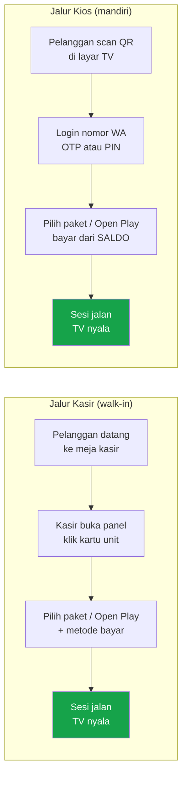

### Prinsip arsitektur

| # | Prinsip | Konsekuensi nyata |
|---|---------|-------------------|
| 1 | **Laravel satu-satunya sumber kebenaran** | Home Assistant & Tasmota hanya *tangan*. State billing tak pernah bergantung pada state device. TV mati bukan berarti sesi berhenti. |
| 2 | **Waktu otoritas server** | Durasi & biaya dihitung dari `started_at`/`ends_at`/`ended_at`. Timer di browser hanya tampilan — mengubah jam HP tidak mengubah tagihan. |
| 3 | **Uang = integer rupiah** | Tidak ada `float` di kolom, kalkulasi, maupun response. Saldo dipotong **di dalam kunci baris** (row lock) — tidak ada main tanpa bayar, bahkan saat dua permintaan datang bersamaan. |
| 4 | **Realtime terukur** | Perubahan tampil di dashboard ≤ 2 detik lewat Reverb; fallback polling 15 detik bila WebSocket putus. |
| 5 | **Fail loud, fail secure** | Perintah device yang gagal memunculkan **alert yang terlihat kasir**, bukan kegagalan diam-diam. Integrasi yang tidak dikonfigurasi mati total, bukan setengah jalan. |
| 6 | **LAN-only untuk panel** | Panel & database **tidak pernah** dipapar internet langsung. Tidak ada port-forward. Akses online hanya lewat VPN mesh — lihat [§3.3](#33-kontrol-online-local--public). |

---

## 2. Kemampuan sistem

<table>
<tr><th width="22%">Domain</th><th>Kemampuan</th></tr>
<tr>
<td><b>Sesi &amp; billing</b></td>
<td>Paket berdurasi tetap · Open Play (bayar per menit) · perpanjangan sesi · pembatalan (void) dengan jejak audit · satu sesi aktif per unit dijamin di level database (kolom unik <code>active_unit_id</code>) · sapuan otomatis sesi kedaluwarsa</td>
</tr>
<tr>
<td><b>Dompet pelanggan</b></td>
<td>Saldo integer rupiah · buku besar penuh (<code>wallet_transactions</code>) · top-up QRIS/transfer/tunai · biaya admin top-up · koreksi saldo manual oleh owner (boleh minus, wajib beralasan) · plafon kredit Open Play −50k dengan jaring pengaman tiap menit · audit saldo vs buku besar harian</td>
</tr>
<tr>
<td><b>Pembayaran</b></td>
<td>QRIS lewat Midtrans (polling keluar, bukan webhook) · verifikasi bukti transfer oleh kasir · tunai · penjaga nominal: gateway yang melaporkan jumlah berbeda tidak pernah diakui lunas · rekonsiliasi pembayaran lunas yang efeknya gagal jalan</td>
</tr>
<tr>
<td><b>Diskon &amp; voucher</b></td>
<td>Kode voucher (di-generate, bukan diketik bebas) · promo otomatis tanpa kode · potongan persen atau nominal · target: paket / Open Play / top-up · batas pemakaian total &amp; per pelanggan · minimum transaksi · pelaporan penggunaan</td>
</tr>
<tr>
<td><b>Kios pelanggan</b></td>
<td>Halaman per unit tanpa login · masuk dengan nomor WhatsApp (OTP) atau PIN · pendaftaran mandiri · pilih paket / Open Play · isi saldo · pesan makanan · riwayat transaksi · notifikasi realtime "pembayaran berhasil" ke HP</td>
</tr>
<tr>
<td><b>Menu / F&amp;B</b></td>
<td>Kategori &amp; item · jam layanan · pesanan dari kios dibayar dari saldo · alur status pesanan · pengembalian saldo otomatis untuk pesanan yang tak pernah disentuh staf</td>
</tr>
<tr>
<td><b>Kontrol perangkat</b></td>
<td>Driver Home Assistant (Android TV/Google TV, webOS, Bravia) · driver Tasmota lewat MQTT · driver manual · Wake-on-LAN · cast layar QR ke TV yang menganggur · verifikasi tertunda (perintah sukses ≠ TV benar-benar bereaksi) · alert perangkat · pemindai jaringan</td>
</tr>
<tr>
<td><b>Peran &amp; izin</b></td>
<td>Filament Shield, ditata per departemen (Keuangan, Operasional, Maintenance, Data Master, Sistem) · aksi non-CRUD sebagai izin tersendiri: void sesi, verifikasi pembayaran, koreksi saldo, penanganan alert</td>
</tr>
<tr>
<td><b>Laporan &amp; audit</b></td>
<td>Laporan penjualan per rentang tanggal · pendapatan per tipe unit (grafik) · lini masa aktivitas dengan pemisahan staf internal &amp; pelanggan kios · buku besar dompet · riwayat perubahan (activitylog)</td>
</tr>
<tr>
<td><b>Notifikasi</b></td>
<td>WhatsApp OTP lewat WAHA · Telegram untuk alert operasional · notifikasi in-panel realtime (bukti transfer masuk, saldo minus, alert perangkat)</td>
</tr>
<tr>
<td><b>Observability</b></td>
<td>Prometheus + Grafana offline · exporter host, kontainer, MySQL, Redis · dashboard ter-provision otomatis</td>
</tr>
</table>

---

## 3. Arsitektur & topologi

### 3.1 Jaringan lokal — 1 server + 10 TV

Semua perangkat berada di **satu jaringan / subnet yang sama**. Router membagi IP
(DHCP), switch menyambungkan semuanya dengan **kabel LAN**, PC server menjalankan
seluruh aplikasi di dalam Docker.

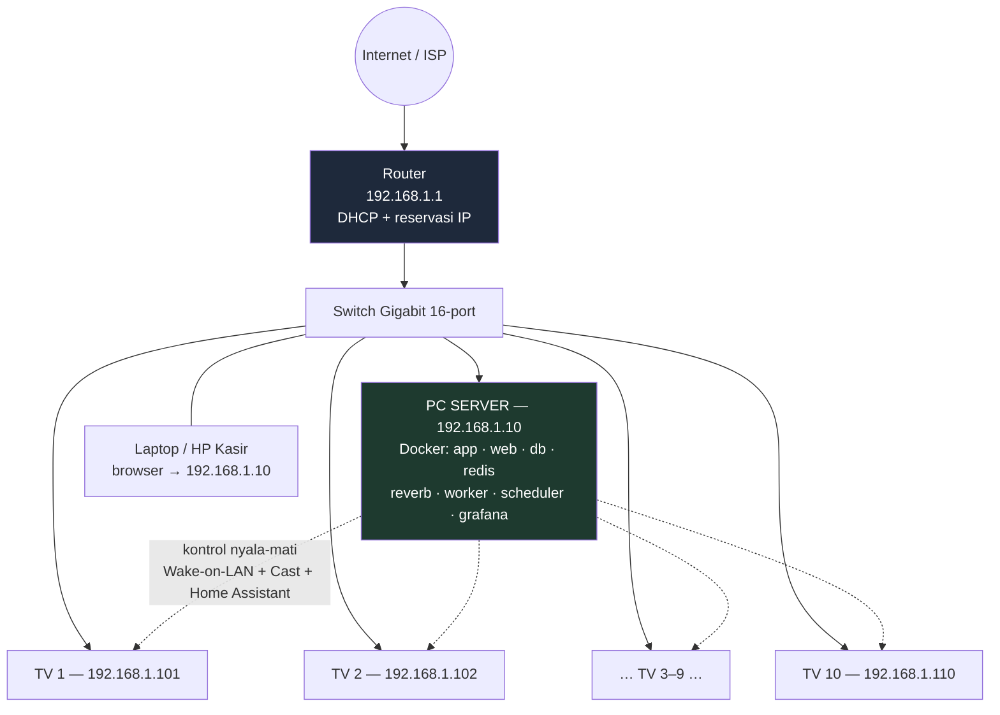

**Aturan emas jaringan lokal:**

| Hal | Nilai wajib | Kenapa |
|-----|-------------|--------|
| Subnet | satu, mis. `192.168.1.0/24` | TV, server, dan kasir harus saling terlihat — mDNS/Cast/WoL tidak melewati router |
| IP server | **statis atau reservasi DHCP** (`192.168.1.10`) | `APP_URL` dan `VITE_REVERB_HOST` menunjuk ke IP ini. Kalau berubah, realtime dan QR mati total |
| IP tiap TV | **reservasi DHCP** | Wake-on-LAN dan entity Home Assistant terikat MAC/IP. IP acak = TV yang salah dinyalakan |
| Kabel TV | **LAN, bukan WiFi** | WoL lewat WiFi sering gagal saat TV standby. Ini syarat, bukan preferensi |
| TV | Android TV / Google TV (mendukung Cast) | QR dan layar idle dikirim lewat `media_player.play_media` |
| VLAN / isolasi klien | **matikan** | "AP isolation" di router memutus jalur server → TV tanpa gejala yang jelas |

> **Tugas manusia (tidak bisa dikerjakan kode):** reservasi DHCP di router,
> mengaktifkan Wake-on-LAN + Networked Standby di setiap TV, dan memasangkan
> TV ke Home Assistant. Lihat [§7](#7-pemasangan--kalibrasi-tv).

### 3.2 Topologi komponen

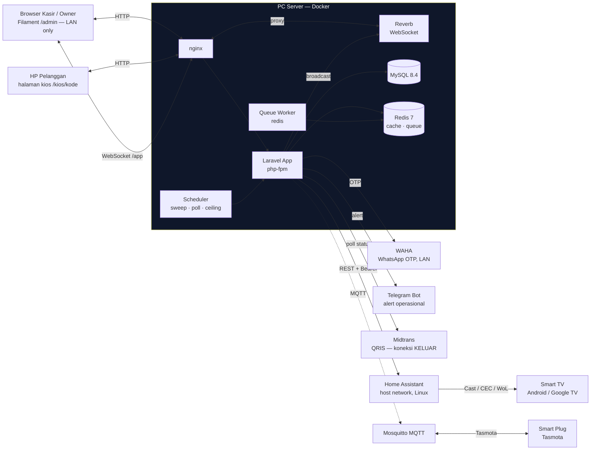

Satu **image Docker** menjalankan semua peran aplikasi (web, reverb, worker,
scheduler); perannya ditentukan oleh `command` di `docker-compose.yml`, bukan oleh
image yang berbeda. Home Assistant dan Mosquitto berjalan terpisah
(`docker-compose.devices.yml`, `network_mode: host`) karena butuh mDNS/WoL yang
tidak melewati jaringan bridge Docker — aplikasi menghubunginya lewat IP LAN server.

### 3.3 Kontrol online: Local ↔ Public

Owner ingin memantau dan mengontrol dari **mana saja lewat domain**, tapi mesin
outlet **tidak boleh** dipapar ke internet (prinsip #6). Solusinya: **VPS memegang
domain + TLS**, dan tersambung ke outlet lewat **VPN mesh WireGuard (Tailscale)** —
koneksi keluar dari LAN, **tanpa port-forward**, tersambung non-stop.

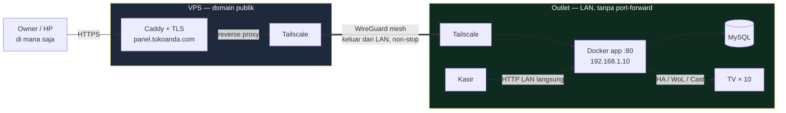

| Peran | Jalur | Kalau internet mati |
|-------|-------|---------------------|
| **Kasir di outlet** | Langsung `http://192.168.1.10` | Tetap jalan **penuh** |
| **Owner online** | `https://panel.tokoanda.com` → VPS → Tailscale → outlet | Kontrol online mati, operasional lokal tidak terganggu |
| **Data** | Tetap di outlet selamanya | VPS hanya reverse-proxy, database tak pernah pindah ke cloud |

> **Kenapa bukan taruh aplikasi di VPS saja?** Karena kontrol TV (mDNS/SSDP,
> Wake-on-LAN, pemindai jaringan) hanya bekerja di **jaringan yang sama dengan TV**.
> VPS di pusat data tidak punya jalan ke `192.168.1.x`. Mesin di outlet adalah
> **syarat**, bukan pilihan.

### 3.4 Alur satu sesi dari kios

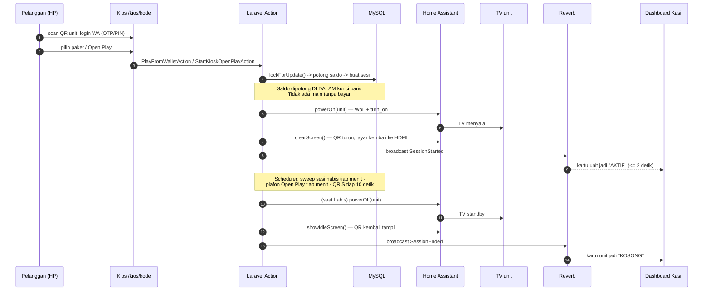

### 3.5 Status sesi

```mermaid
stateDiagram-v2
    [*] --> Pending: pesanan kios dibuat<br/>(menunggu pembayaran)
    [*] --> Active: kasir mulai sesi<br/>(walk-in)

    Pending --> Active: pembayaran LUNAS<br/>(QRIS / bukti transfer diterima)
    Pending --> Voided: QRIS kedaluwarsa /<br/>pesanan baru menggantikan

    Active --> Active: perpanjang sesi
    Active --> Completed: waktu habis (sweep) /<br/>kasir klik Stop
    Active --> Voided: dibatalkan owner<br/>(wajib beralasan)

    Completed --> [*]
    Voided --> [*]

    note right of Pending
        Uang lebih dulu, waktu belakangan.
        Sesi Pending tidak pernah
        menyalakan TV.
    end note
```

### 3.6 Alur pembayaran QRIS (polling, bukan webhook)

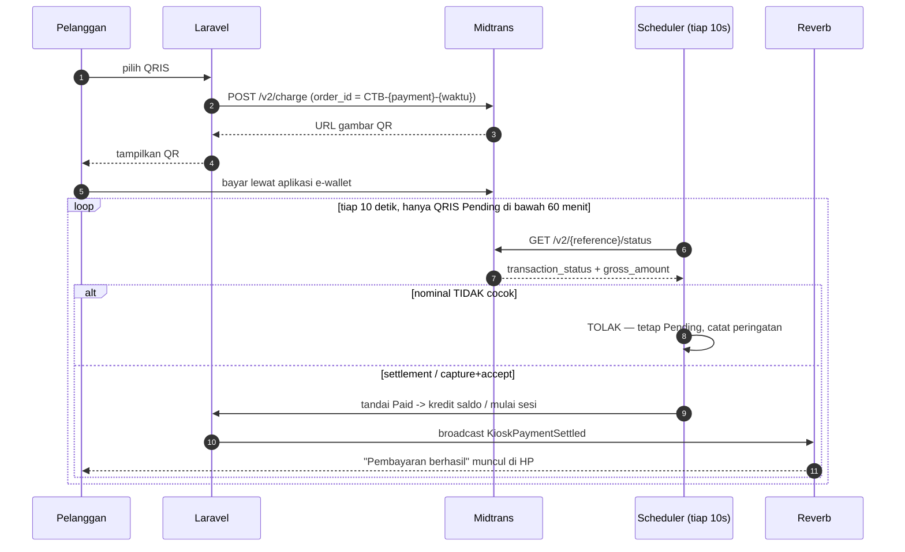

> **Kenapa polling, bukan webhook?** Webhook menuntut Midtrans bisa menghubungi
> mesin outlet dari internet — artinya membuka port ke mesin yang memegang uang.
> Menanya keluar tiap 10 detik jauh lebih murah daripada risiko itu, dan pelanggan
> tetap melihat pembayarannya diakui dalam hitungan detik.

---

## 4. Spesifikasi & daftar belanja

### 4.1 PC Server lokal (untuk ±10 TV)

| Komponen | Minimum | Rekomendasi | Catatan |
|----------|---------|-------------|---------|
| CPU | 4 core (Intel i3 gen-8 / Ryzen 3) | 6+ core (i5 / Ryzen 5) | Mini PC / Intel NUC sangat cocok: hemat daya, senyap |
| RAM | 8 GB | 16 GB | 10 kontainer + MySQL + Grafana |
| Disk | 128 GB SSD | 256 GB SSD NVMe | Database + backup + metrik Prometheus |
| Jaringan | 1× Gigabit Ethernet **berkabel** | idem + WiFi cadangan | Wajib satu subnet dengan TV |
| OS | **Ubuntu Server 24.04 LTS** | idem | Linux **wajib** untuk kontrol device (mDNS/WoL) |
| Daya | UPS ≥ 650 VA | UPS + auto-shutdown | Listrik kedip saat transaksi = database rusak |

> **Windows dan macOS bisa dipakai untuk mencoba** (dengan `control_driver=manual`),
> tapi kontrol TV sungguhan butuh Docker Engine di **Linux**. Lihat [§5](#5-instalasi).

### 4.2 Jaringan

| Barang | Spesifikasi | Jumlah untuk 10 unit |
|--------|-------------|----------------------|
| Router | Wajib mendukung **DHCP reservation per MAC**; matikan AP isolation | 1 |
| Switch | Gigabit, **16 port** (10 TV + server + kasir + 4 cadangan) | 1 |
| Kabel LAN | Cat5e/Cat6, panjang sesuai denah | 11+ jalur |
| Access Point | Untuk HP pelanggan (kios) — bukan untuk TV | 1–2 |

> **Kecepatan internet bukan penentu.** Trafik sistem ini sangat kecil (gambar QR
> ~250 KB, sisanya teks). Yang menentukan adalah **keandalan jalur ke TV**, dan itu
> berarti kabel. WiFi 300 Mbps sekalipun tidak menyelesaikan masalah WoL saat TV
> standby, dan 10 TV + 10 PS5 di satu SSID akan membuat sesi macet di jam ramai.

### 4.3 TV & perangkat unit

| Barang | Spesifikasi | Catatan |
|--------|-------------|---------|
| Smart TV | **Android TV / Google TV** (mendukung Cast) | Contoh teruji: Xiaomi TV A Pro 43" (2026) · TCL Android TV |
| Port LAN TV | RJ45 bawaan | **Cek fisik dulu.** Bila varian TV Anda hanya WiFi, siapkan **USB-Ethernet adapter** (chipset RTL8153) — Google TV mengenalinya |
| Kabel HDMI | Ultra High Speed, 1 per unit | PS5 → TV |
| Smart plug | Tasmota (opsional) | Untuk memutus daya **TV** di luar jam buka. **Jangan pernah** untuk PS5 — mematikan paksa merusak datanya |

### 4.4 Daya listrik — yang paling sering terlewat

| Beban | Satuan | × 10 unit |
|-------|--------|-----------|
| TV 43" (mis. Xiaomi A Pro, 75 W) | 75 W | **750 W** |
| PS5 saat bermain | ± 200 W | **2.000 W** |
| PC server + switch + router | ± 100 W | 100 W |
| **Subtotal sistem** | | **≈ 2,85 kW** |
| AC, lampu, kulkas F&B | bervariasi | + 1–2 kW |

> **Sambungan PLN 2.200 VA akan jeglek.** Siapkan minimal **4.400 VA**, idealnya
> **5.500 VA** bila ada AC. Ini bagian dari daftar belanja, bukan catatan kaki.

### 4.5 VPS (opsional, untuk kontrol online)

| Komponen | Nilai |
|----------|-------|
| Spek | 1 vCPU / 1 GB RAM (hanya reverse-proxy) |
| OS | Ubuntu 24.04 LTS |
| Perangkat lunak | Caddy (TLS otomatis) + Tailscale |
| Domain | 1 subdomain, mis. `panel.tokoanda.com` → IP publik VPS |

### 4.6 Perangkat lunak (sudah disiapkan di image Docker)

| Lapisan | Teknologi |
|---------|-----------|
| Bahasa & framework | PHP 8.3+ (diuji di 8.5) · Laravel 13 |
| Panel admin | Filament v5 · Livewire 4 · **tanpa Node/npm/Vite** (aset ter-compile di `public/`) |
| Basis data | MySQL 8.4 |
| Cache & antrean | Redis 7 (klien `predis`) |
| Realtime | Laravel Reverb 1 (WebSocket) |
| Pengujian | Pest 4 · PHPUnit 12 |
| Perangkat | Home Assistant · Mosquitto (MQTT) · `php-mqtt/client` |
| Lain-lain | `bacon/bacon-qr-code` · `spatie/laravel-activitylog` · Filament Shield |
| Monitoring | Prometheus · Grafana · node/cadvisor/mysql/redis exporter |

### 4.7 Ringkasan daftar belanja

| # | Barang | Jml | Prioritas |
|---|--------|-----|-----------|
| 1 | Mini PC (4+ core, 8–16 GB, 256 GB SSD, LAN Gigabit) | 1 | **Wajib** |
| 2 | UPS ≥ 650 VA | 1 | **Wajib** |
| 3 | Switch Gigabit 16 port | 1 | **Wajib** |
| 4 | Router dengan DHCP reservation | 1 | **Wajib** |
| 5 | Kabel LAN Cat6 (10 TV + server) | 11+ | **Wajib** |
| 6 | Kabel HDMI Ultra High Speed | 10 | **Wajib** |
| 7 | Upgrade daya PLN ke ≥ 4.400 VA | 1 | **Wajib** |
| 8 | USB-Ethernet adapter (bila TV tanpa RJ45) | 0–10 | Kondisional |
| 9 | Access Point untuk HP pelanggan | 1–2 | Dianjurkan |
| 10 | Smart plug Tasmota (TV saja) | 0–10 | Opsional |
| 11 | VPS 1 vCPU + domain + Tailscale | 1 | Opsional |
| 12 | NAS / cloud storage untuk backup di luar server | 1 | **Sangat dianjurkan** |

---

## 5. Instalasi

### 5.1 Pilih jalur yang benar

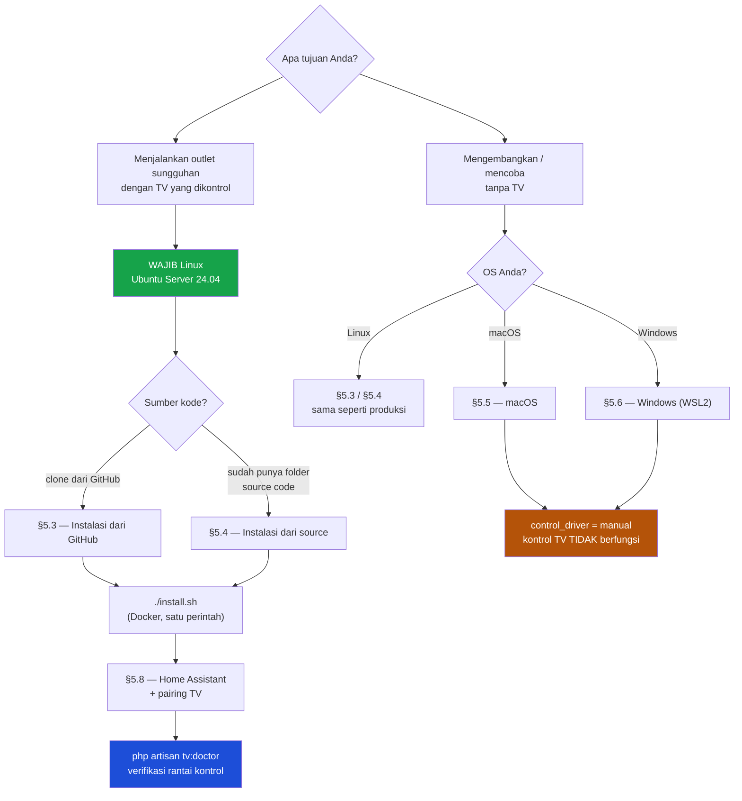

**Ringkasan matriks dukungan:**

| OS | Menjalankan aplikasi | Kontrol TV (mDNS/WoL/Cast) | Cocok untuk |
|----|----------------------|-----------------------------|-------------|
| **Ubuntu / Debian / Linux** | ✅ Penuh | ✅ Penuh | **Produksi** |
| **macOS** (Intel / Apple Silicon) | ✅ Penuh | ❌ Tidak (Docker di macOS tanpa host network) | Pengembangan, demo |
| **Windows 10/11** (WSL2) | ✅ Penuh | ❌ Tidak | Pengembangan, demo |
| **Windows tanpa WSL2** | ⚠️ Tidak dianjurkan | ❌ Tidak | — |

---

### 5.2 Prasyarat Docker (sekali saja, Linux)

```bash
# Ubuntu 24.04 LTS
curl -fsSL https://get.docker.com | sh
sudo usermod -aG docker $USER && newgrp docker   # agar tak perlu sudo
sudo systemctl enable --now docker               # auto-start saat PC menyala
docker --version && docker compose version       # verifikasi
```

---

### 5.3 Instalasi dari GitHub (Linux — jalur produksi)

**Cara termudah. Satu perintah, sisanya otomatis:** membuat `.env`, meng-generate
semua kunci & password, mendeteksi IP LAN, build image, menyalakan seluruh stack
beserta Grafana, dan membuat akun owner.

```bash
git clone https://github.com/<org>/creative-trees-billing.git
cd creative-trees-billing
./install.sh
```

Di akhir, installer menampilkan alamat panel dan Grafana beserta passwordnya.

**Opsi installer (semuanya opsional):**

| Variabel | Contoh | Fungsi |
|----------|--------|--------|
| `SERVER_IP` | `SERVER_IP=192.168.1.10 ./install.sh` | Paksa IP bila deteksi otomatis keliru |
| `OWNER_NAME` · `OWNER_EMAIL` · `OWNER_PASSWORD` | lihat contoh di bawah | Buat owner tanpa tanya-jawab |
| `WITH_MONITORING` | `WITH_MONITORING=0 ./install.sh` | Lewati Grafana & Prometheus |

```bash
OWNER_NAME="Owner" OWNER_EMAIL="owner@outlet.test" OWNER_PASSWORD="rahasia-kuat" \
  SERVER_IP=192.168.1.10 ./install.sh
```

> Installer **aman diulang** — kunci yang sudah ada tidak ditimpa.

<details>
<summary><b>Apa yang dikerjakan installer (kalau ingin manual)</b></summary>

```bash
cp .env.docker .env

# Isi minimal yang WAJIB diubah:
#   APP_URL            = http://<IP LAN server>
#   VITE_REVERB_HOST   = <IP LAN server>       <- 99% masalah realtime ada di sini
#   APP_KEY            = base64:...            (php artisan key:generate)
#   DB_PASSWORD, DB_ROOT_PASSWORD, GRAFANA_PASSWORD
#   REVERB_APP_ID, REVERB_APP_KEY, REVERB_APP_SECRET

docker compose build
docker compose --profile monitoring up -d    # migrasi & optimize jalan otomatis di entrypoint
docker compose exec app php artisan app:create-owner
```

`app:create-owner` membuat outlet default **dan** akun owner sekaligus, lalu
memberinya peran lewat Filament Shield. **Jangan** memakai `make:filament-user` —
`outlet_id` wajib terisi dan peran harus diberikan lewat Shield, dan perintah
bawaan Filament tidak melakukan keduanya.

</details>

**Setelah selesai, buka:**

| Layanan | Alamat | Kredensial |
|---------|--------|------------|
| Panel kasir/owner | `http://<IP-server>` (root diarahkan ke `/admin`) | dibuat oleh `app:create-owner` |
| Halaman kios | `http://<IP-server>/kios/<kode-unit>` | tanpa login |
| Grafana | `http://<IP-server>:3000` | `admin` / isi `GRAFANA_PASSWORD` |

> ⚠️ **Jangan jalankan `php artisan db:seed` di produksi.** Seeder proyek ini
> dev-only: butuh dependensi dev (dikeluarkan dari image produksi) dan membuat data
> contoh (user `@creativetrees.test` + sesi historis palsu) yang tidak boleh masuk
> database outlet sungguhan. Aplikasi berjalan penuh tanpa seed.

---

### 5.4 Instalasi dari source code (folder sudah ada di tangan)

Bila Anda menerima proyek sebagai arsip (`.zip`/`.tar.gz`) atau menyalinnya dari
mesin lain, **tidak perlu** mengambil ulang dari GitHub.

```bash
# 1) Ekstrak dan masuk ke folder
unzip creative-trees-billing.zip
cd creative-trees-billing

# 2) Pastikan berkas tersembunyi ikut tersalin — ini yang paling sering hilang
ls -a | grep -E "^\.(env\.docker|dockerignore|gitignore)$"
#    Kalau .env.docker tidak ada, salin dari mesin sumber. Tanpa itu install.sh gagal.

# 3) Kembalikan izin eksekusi (hilang saat di-zip)
chmod +x install.sh docker/entrypoint.sh deploy/backup/*.sh

# 4) Jalankan installer yang sama
./install.sh
```

**Perbedaan dengan jalur GitHub:**

| Hal | Dari GitHub | Dari source |
|-----|-------------|-------------|
| Riwayat git | Ada — `git pull` untuk update | Tidak ada — update harus manual |
| Berkas tersembunyi | Dijamin lengkap | **Cek manual** (`.env.docker`, `.dockerignore`) |
| Izin eksekusi | Terjaga | **Harus di-`chmod` ulang** |
| Verifikasi keutuhan | `git status` | `composer validate` |

Bila Anda ingin memasang riwayat git di kemudian hari:

```bash
git init && git remote add origin https://github.com/<org>/creative-trees-billing.git
git fetch origin && git reset --soft origin/main
```

---

### 5.5 Instalasi di macOS (pengembangan / demo)

macOS tidak bisa mengontrol TV (Docker di macOS tidak punya host network, jadi
mDNS/WoL tidak sampai ke LAN). Pakai `control_driver=manual` untuk semua unit.

#### Opsi A — Docker Desktop (paling mendekati produksi)

```bash
brew install --cask docker      # lalu buka Docker.app sekali agar daemon jalan
git clone https://github.com/<org>/creative-trees-billing.git
cd creative-trees-billing
./install.sh
```

Buka `http://localhost`. Untuk realtime, isi `VITE_REVERB_HOST=localhost` di `.env`.

> Proyek ini memakai pola `docker-compose.override.yml` untuk keperluan itu.
> Berkas tersebut **lokal-only dan tidak boleh di-commit** — di outlet sungguhan
> nilainya datang dari `.env` (IP LAN), bukan dari `localhost`.

#### Opsi B — Native (paling cepat untuk ngoding)

```bash
# 1) Runtime
brew install php@8.4 composer mysql@8.4 redis
brew services start redis

# 2) MySQL 8.4 di port 3307
#    Port 3307 dipilih agar tidak bentrok dengan MySQL/MariaDB lain di mesin Anda.
#    phpunit.xml sudah mengarah ke sana — kalau diubah, ubah juga di sana.
DD=/opt/homebrew/var/mysql@8.4
BIN=/opt/homebrew/opt/mysql@8.4/bin
"$BIN/mysqld" --datadir="$DD" --basedir=/opt/homebrew/opt/mysql@8.4 \
  --port=3307 --bind-address=127.0.0.1 --socket="$DD/mysql3307.sock" \
  --mysqlx=OFF --log-error="$DD/mysql3307.err" &

# 3) Buat database & pengguna
"$BIN/mysql" -uroot --port=3307 -h127.0.0.1 <<'SQL'
CREATE DATABASE IF NOT EXISTS creative_trees_billing;
CREATE DATABASE IF NOT EXISTS creative_trees_billing_test;
CREATE USER IF NOT EXISTS 'ctb_app'@'%' IDENTIFIED BY 'ctb_local_dev_pw';
GRANT ALL ON creative_trees_billing.* TO 'ctb_app'@'%';
GRANT ALL ON creative_trees_billing_test.* TO 'ctb_app'@'%';
FLUSH PRIVILEGES;
SQL

# 4) Aplikasi
composer install
cp .env.example .env
php artisan key:generate
#    Sunting .env: DB_PORT=3307, DB_DATABASE=creative_trees_billing,
#                  DB_USERNAME=ctb_app, DB_PASSWORD=ctb_local_dev_pw
php artisan migrate
php artisan app:create-owner

# 5) Jalankan (serve + queue + reverb + scheduler sekaligus)
composer run dev
```

> `mysql@8.4` di Homebrew bersifat *keg-only* dan **tidak** punya `brew services` —
> ia harus dinyalakan manual seperti di atas setiap kali mesin dinyalakan ulang.

---

### 5.6 Instalasi di Windows (pengembangan / demo)

**Gunakan WSL2.** Windows tanpa WSL2 tidak dianjurkan: perbedaan izin berkas dan
akhiran baris menimbulkan kegagalan yang sulit dilacak.

#### Langkah 1 — Pasang WSL2 + Ubuntu

Buka **PowerShell sebagai Administrator**:

```powershell
wsl --install -d Ubuntu-24.04
# restart komputer bila diminta, lalu buka "Ubuntu 24.04" dari Start Menu
wsl --set-default-version 2
wsl -l -v            # pastikan VERSION = 2
```

#### Langkah 2 — Pasang Docker

| Cara | Perintah | Catatan |
|------|----------|---------|
| **Docker Desktop** | Unduh dari docker.com, aktifkan *"Use WSL 2 based engine"* + integrasi ke distro Ubuntu | Paling mudah |
| **Docker langsung di dalam WSL** | `curl -fsSL https://get.docker.com \| sh` di terminal Ubuntu | Tanpa Docker Desktop |

#### Langkah 3 — Klon di dalam filesystem Linux

```bash
# DI DALAM terminal Ubuntu (WSL), BUKAN PowerShell
cd ~                      # <- ini penting
git clone https://github.com/<org>/creative-trees-billing.git
cd creative-trees-billing
./install.sh
```

> ⚠️ **Jangan menaruh proyek di `/mnt/c/...`.** Berkas di drive Windows diakses
> lewat lapisan penerjemah yang lambat (Composer bisa 10× lebih lama) dan izin
> berkasnya tidak dipetakan dengan benar, sehingga `install.sh` dan Docker gagal
> dengan pesan yang membingungkan. Selalu pakai `~` (home Linux).

#### Langkah 4 — Akses dari Windows

Buka `http://localhost` di browser Windows — WSL2 meneruskan port secara otomatis.
Isi `VITE_REVERB_HOST=localhost` di `.env` agar realtime bekerja.

#### Masalah khas Windows

| Gejala | Sebab | Solusi |
|--------|-------|--------|
| `install.sh: /bin/bash^M: bad interpreter` | Git mengubah akhiran baris jadi CRLF | `git config --global core.autocrlf input`, lalu klon ulang |
| `permission denied` saat `./install.sh` | Bit eksekusi hilang | `chmod +x install.sh` |
| Composer sangat lambat | Proyek ada di `/mnt/c/` | Pindahkan ke `~` |
| `docker: command not found` di WSL | Integrasi WSL belum aktif | Docker Desktop → Settings → Resources → WSL Integration |

---

### 5.7 Instalasi VPS + Tailscale (kontrol online)

VPS **tidak** menjalankan aplikasi penuh — ia hanya reverse-proxy + TLS ke outlet.

```bash
# ── DI VPS ──────────────────────────────────────────────
curl -fsSL https://tailscale.com/install.sh | sh
sudo tailscale up

sudo apt install -y caddy
sudo tee /etc/caddy/Caddyfile >/dev/null <<'EOF'
panel.tokoanda.com {
    reverse_proxy http://<tailscale-ip-outlet>:80
}
EOF
sudo systemctl reload caddy

# ── DI PC OUTLET ────────────────────────────────────────
curl -fsSL https://tailscale.com/install.sh | sh
sudo tailscale up
sudo tailscale ip -4        # catat IP ini -> masukkan ke Caddyfile di atas
```

Arahkan DNS `panel.tokoanda.com` → IP publik VPS. Caddy mengurus sertifikat
Let's Encrypt otomatis.

| Hasil akhir | Alamat |
|-------------|--------|
| Kasir di outlet | `http://192.168.1.10` (langsung, cepat, tak lewat internet) |
| Owner dari mana saja | `https://panel.tokoanda.com` |
| Internet outlet putus | Kasir tetap penuh; kontrol online pulih sendiri (Tailscale reconnect otomatis) |

---

### 5.8 Home Assistant & Mosquitto (kontrol perangkat)

Berjalan terpisah dari stack aplikasi karena butuh `network_mode: host`.

```bash
docker compose -f docker-compose.devices.yml up -d
# Home Assistant: http://<IP-server>:8123 — buat akun, lalu Settings -> Devices
```

Setelah TV terpasang di Home Assistant, buat **Long-Lived Access Token**
(profil pengguna → Security → Long-lived access tokens) dan isikan ke `.env`:

```dotenv
HA_BASE_URL=http://192.168.1.10:8123
HA_TOKEN=<token panjang dari Home Assistant>
```

Lalu `docker compose up -d --force-recreate app worker scheduler`.

---

### 5.9 Alternatif: bare-metal (nginx + supervisor)

Untuk yang tidak memakai Docker, konfigurasi produksi sudah tersedia di `deploy/`:

| Berkas | Fungsi |
|--------|--------|
| `deploy/nginx/creative-trees-billing.conf` | Server block nginx |
| `deploy/supervisor/reverb.conf` | Proses WebSocket |
| `deploy/supervisor/queue-worker.conf` | Pekerja antrean |
| `deploy/supervisor/scheduler.conf` | Penjadwal |
| `deploy/supervisor/mqtt-bridge.conf` | Jembatan MQTT Tasmota |
| `deploy/backup/backup-database.sh` · `restore-database.sh` · `crontab` | Backup harian |

```bash
composer install --no-dev --optimize-autoloader
php artisan migrate --force
php artisan optimize
php artisan filament:optimize
# pasang nginx + 4 program supervisor + crontab backup
# detail perintah ada di komentar tiap berkas deploy/
```

> **Docker dan bare-metal: pilih SATU per mesin.** Menjalankan keduanya sekaligus
> membuat konfigurasi diam-diam menyimpang.

---

## 6. Konfigurasi `.env`

### 6.1 Kunci yang WAJIB diubah sebelum produksi

| Kunci | Contoh | Akibat bila salah |
|-------|--------|-------------------|
| `APP_KEY` | `base64:...` (`php artisan key:generate`) | Sesi & data terenkripsi tidak bisa dibaca |
| `APP_URL` | `http://192.168.1.10` | **QR di TV tidak akan pernah tampil** (TV mengunduh gambarnya sendiri) |
| `VITE_REVERB_HOST` | `192.168.1.10` | Realtime mati — kartu unit tidak pernah update |
| `DB_PASSWORD` · `DB_ROOT_PASSWORD` | acak, panjang | Database bisa diakses siapa saja di LAN |
| `REVERB_APP_ID` · `_KEY` · `_SECRET` | acak | WebSocket bisa diikuti pihak lain di LAN |
| `GRAFANA_PASSWORD` | acak | Dashboard monitoring terbuka |
| `APP_DEBUG` | `false` | **Stack trace + isi `.env` bocor ke pengunjung** |
| `APP_ENV` | `production` | Perintah dev ikut aktif |

### 6.2 Referensi lengkap

<details>
<summary><b>Aplikasi</b></summary>

| Kunci | Default | Keterangan |
|-------|---------|------------|
| `APP_NAME` | `Creative Trees Billing Game` | Nama yang tampil di panel |
| `APP_ENV` | `production` | `local` untuk pengembangan |
| `APP_DEBUG` | `false` | **Wajib `false` di produksi** |
| `APP_URL` | `http://192.168.1.10` | Harus IP LAN server — dipakai untuk URL QR |
| `APP_LOCALE` | `id` | Bahasa antarmuka |
| `APP_DISPLAY_TIMEZONE` | `Asia/Jakarta` | Zona waktu tampilan & laporan |
| `BCRYPT_ROUNDS` | `12` | Biaya hashing password |
| `LOG_LEVEL` | `info` | `debug` hanya saat menelusuri masalah |

</details>

<details>
<summary><b>Basis data, cache, antrean</b></summary>

| Kunci | Default Docker | Keterangan |
|-------|----------------|------------|
| `DB_CONNECTION` | `mysql` | |
| `DB_HOST` · `DB_PORT` | `db` · `3306` | Di luar Docker: `127.0.0.1` · `3307` |
| `DB_DATABASE` | `creative_trees_billing` | |
| `DB_USERNAME` · `DB_PASSWORD` | `ctb_app` · **ubah** | |
| `DB_ROOT_PASSWORD` | **ubah** | Dipakai kontainer MySQL & script backup |
| `SESSION_DRIVER` | `database` | |
| `CACHE_STORE` | `redis` | |
| `QUEUE_CONNECTION` | `redis` | |
| `REDIS_CLIENT` | `predis` | Tanpa ekstensi PHP tambahan |
| `REDIS_HOST` · `REDIS_PORT` | `redis` · `6379` | |

</details>

<details>
<summary><b>Realtime (Reverb)</b></summary>

| Kunci | Default | Keterangan |
|-------|---------|------------|
| `BROADCAST_CONNECTION` | `reverb` | |
| `REVERB_APP_ID` · `_KEY` · `_SECRET` | kosong | **Wajib diisi acak** |
| `REVERB_HOST` · `REVERB_PORT` | `reverb` · `8080` | Nama service di jaringan Docker (sisi server) |
| `VITE_REVERB_HOST` | `192.168.1.10` | **Yang dilihat browser** — wajib IP LAN, bukan `localhost` |
| `VITE_REVERB_PORT` · `_SCHEME` | `8080` · `ws` | |

> `REVERB_HOST` (sisi server) dan `VITE_REVERB_HOST` (sisi browser) **berbeda dan
> keduanya benar**. Menyamakannya adalah penyebab paling sering realtime tidak jalan.

</details>

<details>
<summary><b>Perangkat & integrasi</b></summary>

| Kunci | Keterangan |
|-------|------------|
| `HA_BASE_URL` · `HA_TOKEN` | Home Assistant. Kosong = kontrol TV mati (fail secure) |
| `MQTT_HOST` · `MQTT_PORT` · `MQTT_USERNAME` · `MQTT_PASSWORD` | Mosquitto untuk Tasmota. Anonim **dimatikan** |
| `WAHA_BASE_URL` · `WAHA_API_KEY` · `WAHA_SESSION` | WhatsApp OTP. Kosong = OTP hanya masuk log (dev) |
| `TELEGRAM_BOT_TOKEN` · `TELEGRAM_CHAT_ID` | Alert operasional. Kosong = tidak mengirim apa pun |

Kredensial Home Assistant, Midtrans, dan MQTT **juga bisa diisi lewat panel**
(menu Integrasi). Nilai di database menang atas `.env`, supaya owner bisa
memperbaruinya tanpa menyentuh server.

</details>

<details>
<summary><b>Port & monitoring</b></summary>

| Kunci | Default | Keterangan |
|-------|---------|------------|
| `WEB_PORT` | `80` | Port panel di host |
| `GRAFANA_PORT` | `3000` | |
| `GRAFANA_USER` · `GRAFANA_PASSWORD` | `admin` · **ubah** | |

</details>

---

## 7. Pemasangan & kalibrasi TV

### 7.1 Alur pemasangan satu unit

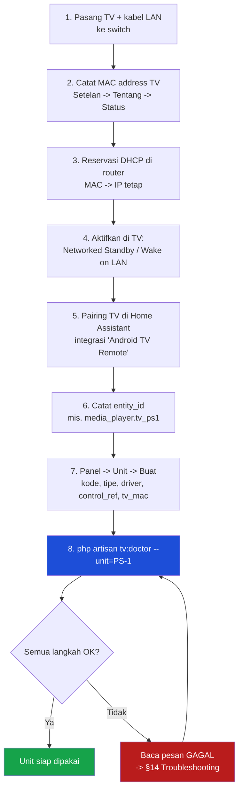

### 7.2 Setelan wajib di TV (Android TV / Google TV)

| Setelan | Lokasi umum | Kenapa wajib |
|---------|-------------|--------------|
| **Networked Standby** / *Wake on LAN* / *Wake on WLAN* | Setelan → Sistem → Daya & Energi | Tanpa ini TV masuk *deep sleep*, koneksi remote terputus, dan **tidak ada perintah jaringan yang bisa membangunkannya** |
| **Chromecast built-in aktif** | Setelan → Aplikasi → Google Cast | Layar QR dikirim lewat `media_player.play_media` |
| **Sambungan LAN**, bukan WiFi | Setelan → Jaringan | WoL lewat WiFi tidak andal saat standby |
| Matikan screensaver agresif | Setelan → Tampilan | Screensaver dapat menutupi QR |

### 7.3 Contoh: Xiaomi TV A Pro 43" (2026)

| Aspek | Status | Catatan |
|-------|--------|---------|
| Sistem operasi | ✅ Google TV | Didukung penuh |
| Integrasi Home Assistant | ✅ **Android TV Remote** | Pairing memakai kode yang muncul di layar TV — **satu pairing per TV** |
| Cast layar QR | ✅ Chromecast built-in | `media_player.play_media` dengan `image/jpeg` |
| Port RJ45 | ⚠️ **Cek fisik** | Bila varian Anda hanya WiFi, pakai USB-Ethernet adapter (RTL8153) |
| Daya | 75 W | 10 unit = 750 W — masuk hitungan [§4.4](#44-daya-listrik--yang-paling-sering-terlewat) |

### 7.4 Verifikasi dengan `tv:doctor`

Perintah ini menguji **seluruh rantai kontrol dari ujung ke ujung**, bukan sekadar
"TV menjawab". Jalankan sambil berdiri di depan TV.

```bash
php artisan tv:doctor                        # semua unit — aman, tidak mematikan TV
php artisan tv:doctor --unit=PS-1            # satu unit saja
php artisan tv:doctor --power                # ikut menyalakan & mematikan TV sungguhan
php artisan tv:doctor --power --settle=12    # beri TV 12 detik untuk bereaksi
```

| Langkah | Menangkap masalah apa |
|---------|------------------------|
| **URL QR** | `APP_URL` menunjuk `localhost` — kegagalan pemasangan **paling sering**. Yang mengunduh gambar QR adalah TV, bukan server; `localhost` di TV berarti TV itu sendiri. Layarnya kosong selamanya sementara Home Assistant tetap menjawab HTTP 200 |
| **Gambar QR** | Ekstensi GD PHP hilang → QR tidak pernah tergambar |
| **Koneksi** | TV tidak menjawab, atau `control_ref` belum dipasangkan ke unit |
| **Cast QR** | Perintah `play_media` ditolak gateway |
| **Nyala / Mati** (`--power`) | TV tidak benar-benar bereaksi. State dibaca **ulang** setelah jeda, karena Home Assistant menjawab `200` untuk `turn_on` walau TV diam saja |

**Jaminan keamanan perintah ini:**

- Unit yang **sedang dipakai pelanggan selalu dilewati** — `--power` tidak akan pernah memotong sesi berbayar.
- Unit ber-`control_driver=manual` dilewati (tidak ada yang bisa diuji).
- TV ditinggalkan menampilkan QR, siap untuk pelanggan berikutnya.
- Exit code non-nol bila ada langkah gagal, sehingga bisa dipasang di skrip buka-outlet.

**Contoh keluaran:**

```
  OK    URL QR    TV mengunduh dari http://192.168.1.10/kios/PS-1/qr.jpg
  OK    Gambar QR 262092 byte

   INFO  Unit PS-1

  OK    Koneksi   Menyala
  OK    Nyala     TV melaporkan Menyala, diharapkan Menyala
  OK    Mati      TV melaporkan Standby, diharapkan Standby
  OK    Cast QR   OK
     LIHAT TV: QR harus tampil sekarang.

   INFO  Semua langkah lolos.
```

---

## 8. Menjalankan sehari-hari

Semua perintah dijalankan dari dalam folder proyek. **Data (DB, Redis, Grafana)
hidup di named volume** dan aman selama tidak memakai `-v`.

| Tujuan | Perintah | Efek pada data |
|--------|----------|----------------|
| Nyalakan semua | `docker compose --profile monitoring up -d` | Aman |
| Matikan sementara | `docker compose stop` | Aman, cepat nyala lagi |
| Matikan & hapus kontainer | `docker compose --profile monitoring down` | **Aman** — volume tetap |
| Restart satu service | `docker compose restart reverb` | Aman |
| Lihat status | `docker compose ps` | — |
| Lihat log | `docker compose logs -f app` | — |
| Log realtime Laravel | `docker compose exec app php artisan pail` | — |
| ⚠️ **Hapus TERMASUK data** | `docker compose down -v` | **MENGHAPUS DATABASE** |

### Mematikan PC server dengan benar

```bash
docker compose stop        # hentikan rapi dulu agar MySQL sempat flush
sudo shutdown -h now
```

### Menyalakan ulang PC server

Karena semua service memakai `restart: unless-stopped` **dan** Docker sudah
`systemctl enable`, begitu PC menyala **semua kontainer hidup sendiri**. Verifikasi:

```bash
docker compose ps          # semua harus 'running' atau 'healthy'
```

### Memperbarui ke rilis baru

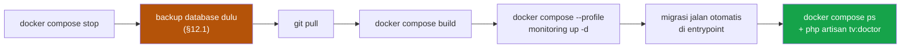

```bash
docker compose stop
docker compose exec db sh -c 'mysqldump -uroot -p"$MYSQL_ROOT_PASSWORD" creative_trees_billing' > backup-$(date +%F).sql
git pull
docker compose build
docker compose --profile monitoring up -d
```

---

## 9. Monitoring Grafana

Profil `monitoring` menyalakan **Prometheus + Grafana + exporter** — semuanya lokal,
**tanpa internet**, sudah terkonfigurasi (datasource dan dashboard ter-provision
otomatis). Buka `http://<IP-server>:3000`.

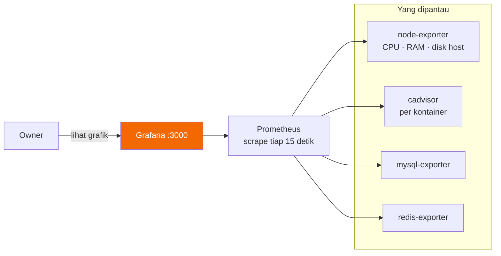

Dashboard **"Creative Trees — System Overview"** langsung tersedia:

| Panel | Isi |
|-------|-----|
| Server (host) | CPU, RAM, disk, uptime |
| Per kontainer | CPU & memori tiap service (app, reverb, worker, db, redis) |
| MySQL | Status up/down, jumlah koneksi, query per detik |
| Redis | Memori terpakai, operasi per detik |

Ganti password default lewat `GRAFANA_PASSWORD` di `.env`. Data metrik disimpan di
volume `prometheus-data`.

---

## 10. Panduan pengguna

### 10.1 Kasir — pengguna awam

Yang perlu diingat kasir hanya ini. **Tidak perlu tahu Docker, terminal, atau
jaringan — cukup browser.**

| # | Tugas | Langkah |
|---|-------|---------|
| 1 | Masuk | Ketik `192.168.1.10` di browser → email & password → dashboard |
| 2 | Membaca dashboard | 10 kartu unit. Hijau = sedang dipakai, abu = kosong. **Update sendiri, tidak perlu refresh** |
| 3 | Mulai sesi | Klik kartu kosong → pilih **paket** atau **Open Play** → pilih pelanggan / isi nama → **Mulai**. TV menyala sendiri |
| 4 | Isi saldo pelanggan | Menu **Member** → cari nama → **Isi Saldo** → QRIS/transfer/tunai → jumlah → simpan |
| 5 | Perpanjang | Kartu memberi tanda saat sesi hampir habis → klik **Perpanjang** |
| 6 | Selesai | Sesi paket berakhir otomatis, TV mati sendiri. Open Play: klik **Stop** |
| 7 | Ada tanda merah di kartu | Berarti TV tidak merespons → lihat [§14](#14-troubleshooting) atau panggil teknisi |

### 10.2 Supervisor / Shift Lead

| Tugas | Jalur di panel |
|-------|----------------|
| Kelola paket & tarif | **Paket** / **Tipe Unit** — harga per jam, durasi, aktif/nonaktif |
| Diskon & voucher | **Diskon** — voucher berkode atau promo otomatis (paket / Open Play / bonus top-up) |
| Verifikasi bukti transfer | **Pembayaran** → tinjau bukti → terima / tolak |
| Laporan penjualan | **Laporan** → rentang tanggal → total, metode bayar, grafik per tipe unit |
| Notifikasi realtime | Lonceng 🔔 kanan atas — bukti transfer masuk, saldo minus, alert perangkat |
| Tangani alert perangkat | **Device Alerts** → baca pesan → tindak → **Acknowledge** |
| Cek kesehatan server | Grafana `:3000` |
| Lihat aktivitas | **Aktivitas** — lini masa staf internal & pelanggan kios, terpisah |

### 10.3 Admin / Teknisi

| Tugas | Rujukan |
|-------|---------|
| Tambah unit baru | [§12.2](#122-menambah-unit-baru) |
| Pasang & kalibrasi TV | [§7](#7-pemasangan--kalibrasi-tv) |
| Kontrol TV lewat Home Assistant | [§5.8](#58-home-assistant--mosquitto-kontrol-perangkat) |
| WhatsApp OTP & Telegram | [§6.2](#62-referensi-lengkap) — kosong = fitur mati diam-diam (fail secure) |
| Backup & restore | [§12.1](#121-backup--restore-database) |
| Perbarui rilis | [§8](#8-menjalankan-sehari-hari) |
| Akses online | [§5.7](#57-instalasi-vps--tailscale-kontrol-online) |
| Log & debug | `docker compose logs -f app` · `php artisan pail` |
| Uji rantai TV | `php artisan tv:doctor --power` |

---

## 11. Referensi perintah

### 11.1 Perintah aplikasi

| Perintah | Fungsi | Kapan dipakai |
|----------|--------|---------------|
| `app:create-owner` | Buat akun owner pertama + outlet default | Sekali, saat instalasi |
| `tv:doctor` | Uji rantai kontrol TV ujung ke ujung | Saat pasang TV baru & sebelum outlet buka |
| `tv:show-idle` | Tampilkan QR di semua TV yang menganggur | Saat outlet buka |
| `units:discover` | Cari TV di jaringan lewat Home Assistant | Saat menambah unit |
| `devices:scan` | Pindai jaringan lokal (SSDP/UPnP) untuk menemukan TV | Saat menambah unit |
| `units:poll-state` | Sinkronkan power state TV | Otomatis (scheduler) |
| `sessions:sweep-expired` | Akhiri sesi paket yang waktunya habis | Otomatis (scheduler) |
| `openplay:enforce-ceiling` | Hentikan Open Play yang mencapai plafon −50k | Otomatis (scheduler) |
| `payments:poll-qris` | Perbarui status QRIS dari Midtrans | Otomatis (scheduler) |
| `payments:reconcile-settled` | Terapkan ulang pembayaran lunas yang efeknya gagal jalan | Otomatis (scheduler) |
| `menu:refund-stale-orders` | Batalkan & kembalikan saldo pesanan yang tak tersentuh | Otomatis (scheduler) |
| `wallet:audit` | Periksa saldo tiap pelanggan terhadap buku besarnya | Otomatis (harian 04:00) |
| `bridge:mqtt-listen` | Dengarkan status power Tasmota lewat MQTT | Proses supervisor (bila pakai Tasmota) |
| `otp:latest` | Tampilkan kode OTP terakhir dari log | **Hanya di luar produksi** |

Di dalam Docker, awali dengan `docker compose exec app`:

```bash
docker compose exec app php artisan tv:doctor --power
```

### 11.2 Scheduler (kontainer `scheduler`)

| Task | Frekuensi | Fungsi |
|------|-----------|--------|
| `sessions:sweep-expired` | tiap menit | Akhiri sesi yang waktunya habis, matikan TV |
| `openplay:enforce-ceiling` | tiap menit | Jaring pengaman plafon kredit Open Play (−50k) |
| `menu:refund-stale-orders` | tiap menit | Kembalikan saldo pesanan yang tak pernah disentuh staf |
| `units:poll-state` | tiap 30 detik | Sinkronkan power state TV |
| `payments:poll-qris` | **tiap 10 detik** | Tanya status QRIS ke gateway (pengganti webhook) |
| `payments:reconcile-settled` | tiap 5 menit | Terapkan ulang efek pembayaran lunas yang gagal |
| `wallet:audit` | harian 04:00 | Rekonsiliasi saldo vs buku besar (hanya melapor, tidak membetulkan) |

> `payments:poll-qris` setiap 10 detik menentukan seberapa cepat pelanggan melihat
> "Pembayaran berhasil". Sebelumnya tiap menit, dan pelanggan menunggu sampai 60
> detik di depan QR yang sudah dibayar.

---

## 12. Operasional & runbook

### 12.1 Backup & restore database

```bash
# ── Backup manual (Docker) ──
docker compose exec db sh -c 'mysqldump -uroot -p"$MYSQL_ROOT_PASSWORD" creative_trees_billing' \
  > backup-$(date +%F).sql

# ── Restore ──
docker compose exec -T db sh -c 'mysql -uroot -p"$MYSQL_ROOT_PASSWORD" creative_trees_billing' \
  < backup-2026-07-28.sql

# ── Otomatis harian (bare-metal) ──
# pasang deploy/backup/crontab — berjalan jam 03:00
```

> **Simpan salinan backup di luar PC server** (NAS atau cloud milik owner) dan
> **uji restore minimal sekali** sebelum mengandalkannya. Backup yang belum pernah
> dipulihkan bukan backup — hanya berkas.

### 12.2 Menambah unit baru

1. Pasang TV, kabel LAN, dan **reservasi DHCP** di router (catat MAC & IP).
2. Aktifkan **Networked Standby / Wake-on-LAN** di TV.
3. Pairing TV di Home Assistant, catat `entity_id`.
4. Panel → **Unit** → **Buat**: isi kode, tipe unit, `control_driver`, `control_ref` (entity_id atau topic), `tv_mac`.
5. Verifikasi: `php artisan tv:doctor --unit=<kode> --power`.

### 12.3 Tugas manusia (tidak bisa dikerjakan kode)

| Tugas | Frekuensi |
|-------|-----------|
| Reservasi DHCP di router | Sekali per TV |
| Setelan Wake-on-LAN / Networked Standby tiap TV | Sekali per TV |
| Pairing TV ke Home Assistant | Sekali per TV |
| Membuat kredensial Mosquitto (anonim dimatikan) | Sekali |
| Scan QR WhatsApp untuk sesi WAHA | Sekali, ulangi bila sesi kedaluwarsa |
| UAT hardware siklus penuh sebelum uang sungguhan | Sekali, sebelum buka |
| Uji restore backup | Sekali, lalu berkala |

---

## 13. Pengujian & UAT

### 13.1 Menjalankan test suite

```bash
# Di dalam Docker — LEWAT SERVICE `test`, bukan service `app`
docker compose --profile test run --rm test php artisan test --compact
docker compose --profile test run --rm test php artisan test --filter=TvDoctor
docker compose --profile test run --rm test php artisan test --testsuite=Concurrency

# Tanpa Docker (butuh MySQL di port 3307 — lihat §5.5)
php artisan test --compact
```

> **Jangan pernah `docker compose exec app php artisan test`.** Service `app`
> memakai `env_file: .env`, dan variabel `<env>` di `phpunit.xml` hanya berlaku
> bila belum ada di proses — jadi test akan memakai `APP_ENV=production` **dan
> database produksi**, lalu `RefreshDatabase` menjalankan `migrate:fresh`
> (DROP semua tabel) di data outlet sungguhan. Service `test` ada justru karena
> ini: ia sengaja tidak membaca `.env`. Lapis terakhirnya di
> `tests/TestCase.php`, yang menolak berjalan bila nama database tidak
> berakhiran `_test`.

**Status saat ini: 573 test, 573 lulus, 1.413 assertion** (Unit + Feature +
Concurrency, dijalankan di dalam Docker).

| Suite | Isi |
|-------|-----|
| `tests/Unit` | Kalkulator billing Open Play, Wake-on-LAN, topik Tasmota |
| `tests/Feature` | Domain (billing, dompet, diskon, sesi, kios, menu), panel Filament, kebijakan izin, notifikasi, realtime, perintah konsol, keamanan |
| `tests/Concurrency` | Proses anak sungguhan yang berebut unit yang sama — membuktikan kunci baris bekerja |

Suite `Concurrency` memakai `DatabaseTruncation`, bukan `RefreshDatabase`, karena
proses anak memakai koneksi terpisah dan tidak bisa melihat transaksi yang belum
di-commit.

### 13.2 Checklist UAT sebelum outlet buka

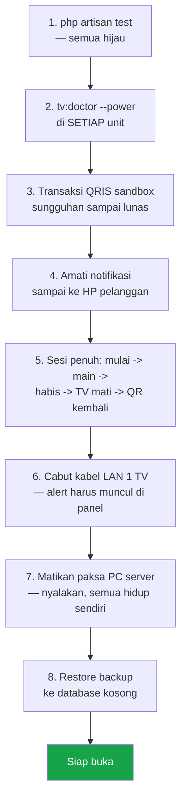

| # | Uji | Kriteria lulus |
|---|-----|----------------|
| 1 | Test suite | 572/572 lulus |
| 2 | `tv:doctor --power` per unit | Semua langkah OK, QR terlihat di TV |
| 3 | QRIS sandbox | Status berubah lunas ≤ 10 detik |
| 4 | Notifikasi realtime | "Pembayaran berhasil" muncul di HP ≤ 2 detik setelah lunas |
| 5 | Siklus sesi penuh | TV nyala saat mulai, mati saat habis, QR kembali tampil |
| 6 | Simulasi gangguan | Alert perangkat muncul di panel dan lonceng |
| 7 | Pemulihan daya | Semua kontainer `running` tanpa perintah manual |
| 8 | Restore backup | Data pulih utuh di database kosong |

### 13.3 Yang belum tercakup pengujian otomatis

Jujur soal batas — ini yang **harus** diverifikasi manual dengan perangkat nyata:

| Area | Kenapa tidak bisa diuji otomatis |
|------|----------------------------------|
| Perangkat keras sungguhan | WoL, MQTT Tasmota, polling Home Assistant, Google Cast — protokolnya diuji, perangkatnya tidak |
| Reverb + Redis produksi | Test berjalan dengan `BROADCAST=null`, `CACHE=array`, `QUEUE=database` |
| Scheduler jangka panjang | `withoutOverlapping()` yang macet hanya terlihat setelah berjam-jam |
| Midtrans produksi | Hanya sandbox yang diuji; uang sungguhan belum pernah lewat |
| WAHA WhatsApp | Pengiriman OTP nyata |
| Halaman kios di browser | Komponen Livewire diuji, tapi belum ada test browser |
| Restore backup | Skrip ada, keberhasilannya harus dibuktikan sekali |
| Klaim LAN-only | Perlu port scan dari luar untuk membuktikan |

---

## 14. Troubleshooting

| Gejala | Kemungkinan penyebab | Tindakan |
|--------|----------------------|----------|
| **Realtime diam, kartu tidak update** | `VITE_REVERB_HOST` masih `localhost` | Isi IP LAN → `docker compose up -d --force-recreate app reverb`. Cek `docker compose logs reverb` |
| **QR tidak muncul di TV** (perintah sukses) | `APP_URL` menunjuk `localhost` — TV mencari gambar pada dirinya sendiri | `php artisan tv:doctor` akan menyebutnya. Perbaiki `APP_URL` ke IP LAN |
| **TV tidak nyala / tidak mati** | Networked Standby mati, reservasi DHCP belum dibuat, atau HA tidak sesubnet | `php artisan tv:doctor --power`. Cek **Device Alerts** di panel |
| **"Pembayaran berhasil" lama muncul** | Scheduler tidak jalan atau gateway tak terjangkau | `docker compose logs scheduler`; uji konektivitas keluar ke Midtrans |
| **Panel tidak bisa dibuka** | Service `web`/`app` tidak sehat | `docker compose ps` → `docker compose logs app` |
| **Owner tidak bisa akses online** | Tailscale putus, DNS salah, Caddy belum reload | `tailscale status` di kedua mesin; cek DNS; `systemctl reload caddy` |
| **Tampilan / aset rusak** | Cache aset Filament basi | `docker compose exec app php artisan filament:optimize` |
| **Disk penuh** | Image lama & retensi metrik | `docker image prune`; periksa retensi Prometheus dan rotasi log |
| **Migrasi tertinggal setelah update** | Entrypoint gagal di tengah | `docker compose exec app php artisan migrate --force` |
| **OTP tidak sampai (dev)** | WAHA belum dikonfigurasi | `php artisan otp:latest` untuk membaca kode dari log |
| **Test gagal: tidak bisa konek DB** | MySQL 3307 belum jalan (macOS) | Lihat [§5.5](#55-instalasi-di-macos-pengembangan--demo) opsi B, langkah 2 |
| **`install.sh: bad interpreter`** | Akhiran baris CRLF (Windows) | `git config --global core.autocrlf input`, klon ulang |

---

## 15. Keamanan

| Aspek | Penerapan |
|-------|-----------|
| **Paparan jaringan** | Panel & database **tidak pernah** dipapar internet. Tidak ada port-forward. Akses online hanya lewat WireGuard mesh (Tailscale) |
| **Satu-satunya halaman publik** | `/kios/{kode}` dan gambar QR-nya. Isinya hanya tautan ke halaman kios itu sendiri — tidak ada rahasia di dalamnya |
| **Otentikasi pelanggan** | Nomor WhatsApp + OTP, atau PIN. Keduanya **dibatasi laju** (rate limit) dengan penguncian setelah gagal berulang |
| **Guard terpisah** | Pelanggan kios memakai guard `customer`, staf memakai guard `web`. Kanal broadcast privat pelanggan diotorisasi lewat guard `customer` saja |
| **Otorisasi** | Filament Shield berbasis izin di database. Aksi non-CRUD (void sesi, verifikasi pembayaran, koreksi saldo, alert perangkat) punya izin tersendiri |
| **Uang** | Saldo dipotong di dalam kunci baris. Nominal yang dilaporkan gateway wajib sama dengan yang ditagih — bila berbeda, **tidak pernah** diakui lunas |
| **Rahasia** | Hanya lewat `.env` atau tabel Integrasi. **Dilarang** muncul di log, response, exception, atau payload broadcast — dijaga oleh `tests/Feature/Security/NoSecretsInLogsTest.php` |
| **MQTT** | Mosquitto anonim dimatikan (fail secure) |
| **Integrasi kosong** | Fitur mati total, bukan setengah jalan |

**Sebelum produksi, pastikan:**

- [ ] `APP_DEBUG=false` dan `APP_ENV=production`
- [ ] Semua password default (`change_me`) sudah diganti
- [ ] `REVERB_APP_SECRET` acak dan panjang
- [ ] Grafana tidak memakai password bawaan
- [ ] Tidak ada port yang di-forward di router menuju server
- [ ] Backup berjalan dan **restore-nya sudah pernah diuji**

---

## 16. Keputusan teknis

| Keputusan | Alasan |
|-----------|--------|
| **`outlet_id` sejak V1** | Fondasi siap-scale di `users`/`unit_types`/`units`. V1 berjalan single-outlet tanpa UI ganti-outlet |
| **Polling, bukan webhook** | Mesin outlet tidak menerima koneksi dari internet. Status QRIS & power TV ditanyakan **keluar**. Frekuensi poll menentukan kecepatan respons (QRIS ≤ 10 detik, power ≤ 30 detik) |
| **QR unit disimpan sebagai berkas, bukan cache DB** | Menggambarnya ± 750 ms, jadi menyimpannya perlu. Tapi cache-nya adalah database, dan JPEG 200 KB membuat query meledak — gambar tempatnya di disk |
| **Sub-minute schedule dibulatkan** | Laravel tidak punya preset 45 detik; dipakai preset terdekat (`everyThirtySeconds`, `everyTenSeconds`) |
| **Job expiry tanpa ID pembatalan** | Sweep tiap menit adalah jaring pengaman, bukan pembatalan presisi |
| **Perintah device tidak pernah menggagalkan billing** | `DeviceManager::attempt()` menelan kegagalan menjadi log terstruktur. Prinsip #1: state billing tak bergantung pada state device |
| **Verifikasi power tertunda, bukan langsung** | Home Assistant menjawab `200` untuk `turn_on` walau TV tidak bereaksi. Jawaban sukses tidak membuktikan apa pun — verifikasinya harus terjadi belakangan, di luar transaksi billing |
| **Tanpa Node/npm/Vite** | Aset Filament sudah ter-compile di `public/`. Satu rantai build lebih sedikit yang bisa rusak di mesin outlet |
| **Docker dan bare-metal: pilih satu** | Menjalankan keduanya membuat konfigurasi diam-diam menyimpang |
| **Uang = integer rupiah** | Tidak ada `float` di mana pun. Midtrans hanya menerima rupiah bulat, dan nilai kita memang sudah integer — tidak ada pembulatan diam-diam |

---

## 17. Referensi teknis

### 17.1 Struktur direktori

```
app/
├── Console/Commands/     Perintah artisan (14 perintah, lihat §11.1)
├── Domain/               Logika bisnis — inti aplikasi
│   ├── Billing/          Tarif, Open Play, Midtrans, pembayaran kios
│   ├── Customers/        Pelanggan, OTP, otentikasi kios
│   ├── Devices/          Driver TV, Wake-on-LAN, MQTT, alert perangkat
│   ├── Discounts/        Voucher, promo otomatis, mesin diskon
│   ├── Kiosk/            Layar QR untuk TV, brand
│   ├── Menu/             F&B, jam layanan, pesanan
│   ├── Sessions/         Mulai, perpanjang, selesai, batalkan sesi
│   ├── Settings/         Pengaturan bercache
│   ├── Users/            Staf outlet
│   └── Wallet/           Saldo, buku besar, top-up
├── Filament/             Panel admin (Resources, Widgets, Pages)
├── Listeners/            Reaksi terhadap event domain
├── Models/               Model Eloquent — hanya model, tanpa logika berat
├── Notifications/        WhatsApp, Telegram, notifikasi panel
├── Policies/             Otorisasi
└── Providers/            Service provider & konfigurasi panel

database/
├── factories/            Factory untuk pengujian
├── migrations/           26 berkas — SATU TABEL, SATU MIGRASI (lihat §17.2)
└── seeders/              DEV-ONLY — jangan dijalankan di produksi

deploy/                   Konfigurasi bare-metal (nginx, supervisor, backup)
docker/                   Dockerfile & entrypoint
resources/views/
├── components/kiosk/     Komponen kios (Livewire single-file)
└── kiosk/                Halaman kios
routes/
├── channels.php          Otorisasi kanal broadcast
├── console.php           Jadwal (scheduler)
└── web.php               Rute HTTP — hanya 3 rute
tests/
├── Concurrency/          Proses anak sungguhan (DatabaseTruncation)
├── Feature/              Mayoritas pengujian
└── Unit/                 Fungsi murni
```

### 17.2 Aturan migrasi: satu tabel, satu migrasi

Struktur database dibaca dari **26 berkas migrasi**, dan tiap tabel punya
**tepat satu** migrasi yang memuat bentuk finalnya. Tidak ada berkas `add_*`,
`drop_*`, atau `change_*` yang menambal tabel yang sudah dibuat.

| Hal | Migrasi tambalan | Satu tabel = satu migrasi |
|-----|------------------|---------------------------|
| Membaca bentuk tabel | Buka migrasi utama, lalu cari semua `add_`/`drop_` yang menyentuhnya | Buka satu berkas, selesai |
| Kolom yang dibuat lalu dihapus | Ada (`users.role` dibuat di satu berkas, dihapus di berkas lain) | Tidak pernah lahir |
| Jumlah berkas | 30 | **26** |
| Struktur akhir | — | **Identik**, terbukti lewat diff `mysqldump` |

**Aturan wajib saat mengubah struktur:**

```bash
# 1. Buat migrasi seperti biasa selama pengembangan
php artisan make:migration add_kolom_baru_to_units_table

# 2. SEBELUM merge: pindahkan isinya ke migrasi utama tabelnya,
#    lalu hapus berkas add_* tadi.
#    Untuk create_units_table -> cukup tambah barisnya di Schema::create().

# 3. Buktikan struktur tidak berubah:
php artisan migrate:fresh --force
php artisan test --compact          # 572/572 harus lulus
```

**Satu pengecualian yang sah — kunci asing lintas tabel.** `wallet_transactions`
lahir sebelum `menu_orders`, jadi kolom `menu_order_id` dideklarasikan di
migrasi `wallet_transactions` (tanpa `->constrained()`), sementara kunci
asingnya dipasang di `create_menu_orders_table` tepat setelah tabelnya ada.
Itu bukan tambalan — itu satu-satunya urutan yang mungkin.

> ⚠️ **Konsekuensi yang harus dipahami:** menggabungkan migrasi berarti database
> yang **sudah pernah** menjalankan migrasi versi lama tidak bisa lagi
> di-`migrate` maju. Ini aman sekarang karena sistem belum dipakai produksi.
> Setelah outlet berjalan dengan uang sungguhan, **jangan** menggabungkan
> migrasi lagi — buat migrasi baru seperti biasa.

> **Jangan pakai `php artisan schema:dump`.** Ia menghasilkan
> `database/schema/mysql-schema.sql`, dan begitu berkas itu ada Laravel memuatnya
> dan **melewati seluruh migrasi** — test akan tetap hijau tanpa pernah menguji
> satu pun migrasi Anda. Migrasi adalah sumber kebenaran di proyek ini.

### 17.3 Entity Relationship Diagram

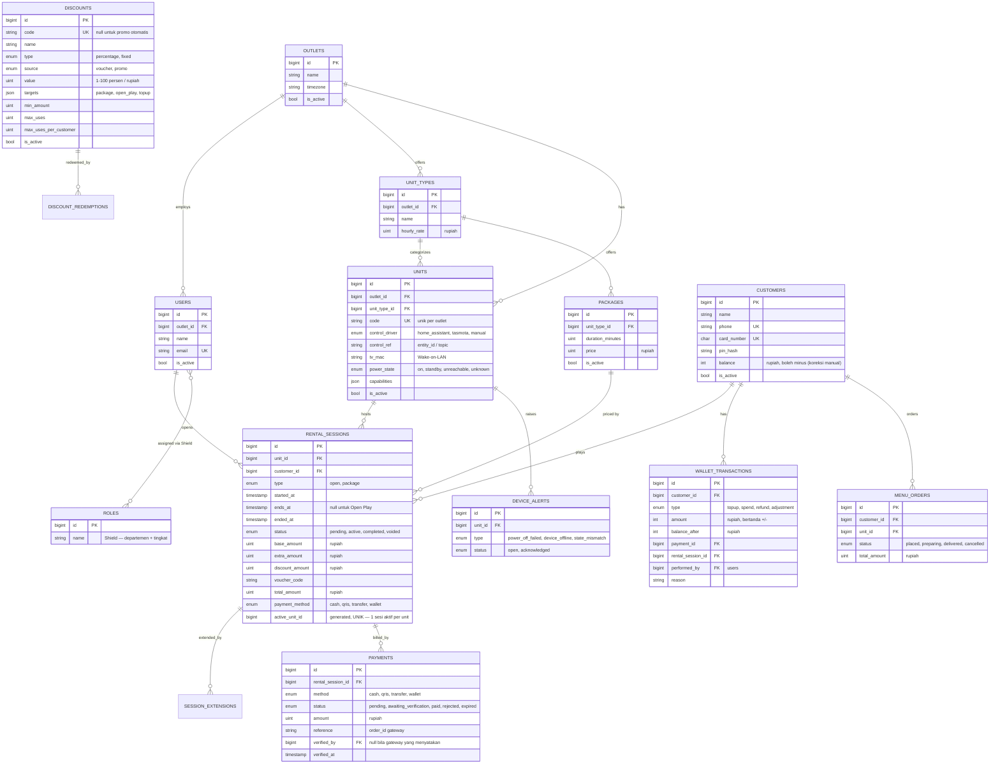

### 17.4 Sequence: sesi berakhir → TV mati → verifikasi

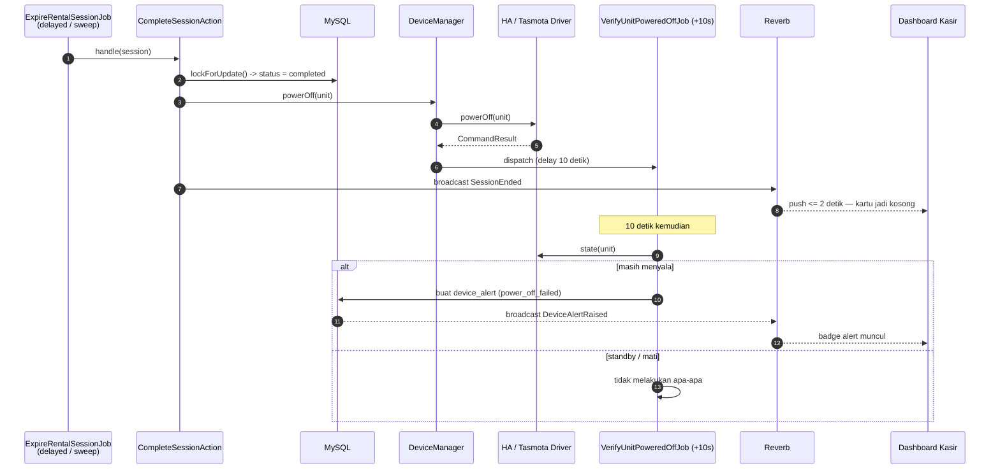

### 17.5 Rute HTTP

Aplikasi ini sengaja hanya punya **tiga** rute HTTP; sisanya ditangani panel Filament.

| Metode | Rute | Nama | Auth |
|--------|------|------|------|
| GET | `/` | — | Redirect ke `/admin` |
| GET | `/kios/{unit:code}` | `kiosk.unit` | **Tanpa login** |
| GET | `/kios/{unit:code}/qr.jpg` | `kiosk.unit.qr` | **Tanpa login** (TV tidak punya sesi) |

### 17.6 Kanal broadcast

| Kanal | Guard | Siapa yang boleh |
|-------|-------|------------------|
| `App.Models.User.{id}` | `web` | User itu sendiri |
| `panel.units` | `web` | Semua staf panel yang aktif |
| `customer.{customerId}` | **`customer`** | Pelanggan kios itu sendiri saja |

---

## 18. Konvensi pengembangan

### 18.1 Gaya kode

| Aturan | Penerapan |
|--------|-----------|
| Formatter | **Laravel Pint** — jalankan `vendor/bin/pint --dirty` sebelum commit |
| Kurung kurawal | Selalu, bahkan untuk badan satu baris |
| Constructor | Gunakan *property promotion* PHP 8 |
| Tipe | Deklarasi tipe kembalian & tipe parameter **eksplisit** di semua metode |
| Enum | Kunci `TitleCase` (`HomeAssistant`, `Monthly`) |
| Komentar | Utamakan blok PHPDoc. Komentar sebaris hanya untuk logika yang benar-benar rumit |
| Penamaan | Deskriptif — `isRegisteredForDiscounts`, bukan `discount()` |
| Berkas | Command **tanpa** akhiran `Command`; job **dengan** akhiran `Job`; `app/Models` hanya berisi model Eloquent |

### 18.2 Alur kerja

```bash
php artisan make:class ...        # gunakan generator artisan, jangan buat berkas manual
vendor/bin/pint --dirty           # format sebelum commit
php artisan test --compact        # semua harus hijau
```

| Prinsip | Alasan |
|---------|--------|
| **Test lebih penting daripada script verifikasi** | Jangan membuat script sekali pakai atau `tinker` bila test sudah membuktikannya |
| **Ikuti struktur direktori yang ada** | Jangan membuat folder dasar baru tanpa persetujuan |
| **Jangan ubah dependensi tanpa persetujuan** | `composer.json` adalah keputusan arsitektur |
| **Cari komponen yang sudah ada sebelum menulis baru** | Duplikasi adalah utang yang dibayar dua kali |
| **Factory untuk data uji** | Periksa dulu apakah factory punya state kustom yang cocok |
| **Jangan hapus test tanpa persetujuan** | |

### 18.3 Pengujian dengan Pest

```bash
php artisan make:test --pest NamaFiturTest     # tanpa awalan direktori suite
php artisan test --compact --filter=namaTest
```

Mayoritas pengujian sebaiknya **feature test**, bukan unit test. Gunakan factory,
bukan penyusunan model manual.

---

<div align="center">

**Creative Trees Billing Game**

PHP 8.3+ · Laravel 13 · Filament v5 · Livewire 4 · MySQL 8.4 · Redis 7 · Reverb 1 · Pest 4

Tanpa Node · Tanpa npm · Tanpa Vite

</div>
